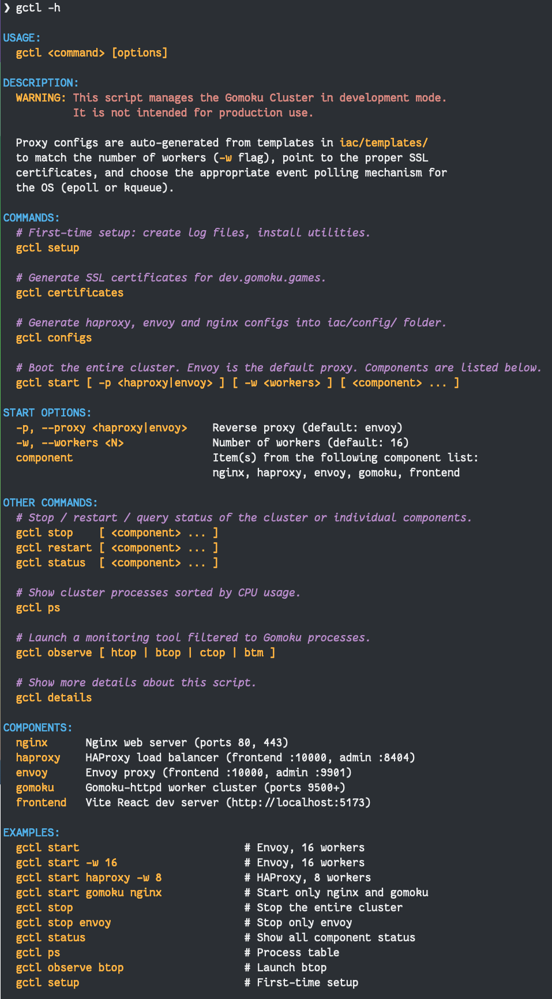
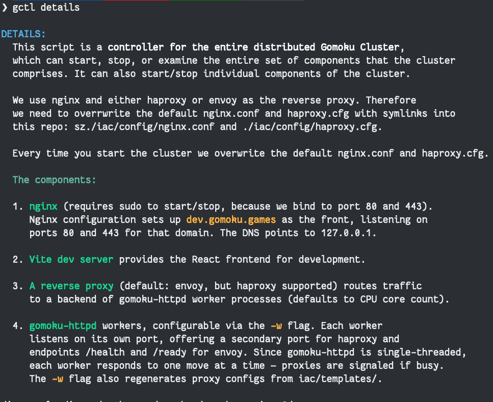

# Cluster Management

This document covers running the Gomoku cluster locally on a development machine using the `gctl` controller script. For production deployment on Kubernetes, see [doc/PRODUCTION.md](doc/PRODUCTION.md).
## Overview

Since `gomoku-httpd` is single-threaded, serving web traffic requires a swarm of worker processes behind a reverse proxy. The local cluster consists of:

| Component      | Default Port(s) | Description                                        |
|----------------|------------------|----------------------------------------------------|
| **nginx**      | 80, 443          | TLS termination, static assets, upstream routing   |
| **envoy**      | 10000 (fe), 9901 (admin) | Reverse proxy with least-request LB, health checks |
| **haproxy**    | 10000 (fe), 8404 (admin) | Alternative reverse proxy with agent-check LB      |
| **gomoku-httpd** | 9500+          | Worker processes (one per port)                    |
| **frontend**   | 5173             | Vite React dev server                              |

### Architecture

```
Browser ──► nginx (:443 TLS) ──► envoy/haproxy (:10000) ──► gomoku-httpd (:9500..N)
                                                             (worker pool)
Frontend dev: http://localhost:5173
```

The sequence diagram below illustrates the request flow:


# Managing Cluster in Development using `gctl`

> [!IMPORTANT]
> We'll only say this once, but get `direnv` working so that `bin` folder is added to your `$PATH` when you cd into the project.This is why we use `gctl` in these examples, and not `bin/gctl`.

## `gctl` Help Screen

Nothing tells you more about a utility than its help page. `gctl` has two: regular `-h` and `details`:



### And the Details



## Prerequisites

Before first use, run the one-time setup:

```bash
gctl setup
```

This will:
- Install [Bashmatic](https://github.com/kigster/bashmatic) (the shell framework used by `gctl`)
- Create and set permissions on log files under `/var/log/`
- Configure `direnv`
- Install monitoring utilities (`btop`, `htop`, `ctop`, `bottom`)

## Quick Start

```bash
# Start the full cluster with Envoy (default) and 10 workers
gctl start

# Start with 16 workers
gctl start -w 16

# Start with HAProxy instead of Envoy
gctl start -p haproxy

# Start with HAProxy and 8 workers
gctl start -p haproxy -w 8
```

When you run `gctl start`, the script automatically generates the proxy configuration (haproxy.cfg or envoy.yaml) from templates in `iac/templates/` to match the requested number of workers. This means you no longer need to manually edit config files when changing worker counts.

## Commands Reference

### Cluster Lifecycle

```bash
# Start the entire cluster (envoy is the default proxy)
gctl start [-p <haproxy|envoy>] [-w <workers>]

# Stop all components
gctl stop

# Restart everything
gctl restart

# Check status of all components
gctl status
```

### Operating Individual Components

You can pass components to `start`, `stop`, and `restart`, such as `nginx`, `frontend`, `envoy`, `haproxy`, `gomoku`.

```bash
# Start only nginx and gomoku workers
gctl start nginx gomoku

# Restart only envoy
gctl restart envoy

# Stop only the frontend dev server
gctl stop frontend

# Check status of gomoku workers
gctl status gomoku
```

Available component names: `nginx`, `haproxy`, `envoy`, `gomoku` (alias: `gomoku-httpd`), `frontend`.

### Monitoring

```bash
# Show cluster processes sorted by CPU usage
gctl ps

# Launch a monitoring tool filtered to Gomoku processes
gctl observe btop
gctl observe htop
gctl observe ctop
gctl observe btm
```

### Setup

```bash
# First-time setup: log files, utilities, direnv
gctl setup
```

## Dynamic Config Generation

The proxy configuration files are generated on the fly from shell templates located in `iac/templates/`:

| Template                           | Output                           |
|------------------------------------|----------------------------------|
| `iac/templates/haproxy.cfg.sh`     | `$(brew --prefix)/etc/haproxy.cfg` |
| `iac/templates/envoy.yaml.sh`      | `iac/envoy/envoy.yaml`          |

Each template accepts a single argument — the number of workers — and writes the appropriate config with matching upstream/backend entries.

You can also invoke them directly:

```bash
# Generate an envoy config for 16 workers
bash iac/templates/envoy.yaml.sh 16 > iac/envoy/envoy.yaml

# Generate a haproxy config for 8 workers
bash iac/templates/haproxy.cfg.sh 8 > /usr/local/etc/haproxy.cfg
```

## Admin Interfaces

- **Envoy admin:** http://127.0.0.1:9901
- **HAProxy stats:** http://127.0.0.1:8404/stats

## Log Files

All components log to `/var/log/`:

| File                            | Component       |
|---------------------------------|-----------------|
| `/var/log/nginx/access.log`     | nginx access    |
| `/var/log/nginx/error.log`      | nginx errors    |
| `/var/log/envoy.log`            | Envoy proxy     |
| `/var/log/haproxy.log`          | HAProxy         |
| `/var/log/gomoku-httpd.log`     | gomoku workers  |
| `/var/log/gomoku-frontend.log`  | Vite dev server |

## Production Deployment

For deploying to Google Kubernetes Engine (GKE) with autoscaling, TLS, and multi-zone redundancy, see the full production guide:

- [Production Deployment on GKE](doc/PRODUCTION.md)
- [Kubernetes manifests](iac/k8s/README.md)
- [SystemD deployment](iac/systemd/README.md)
- [Google Cloud Run](iac/cloud_run/README.md)
