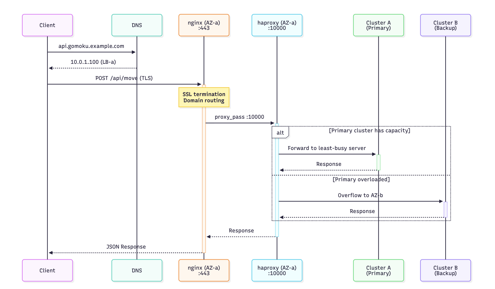
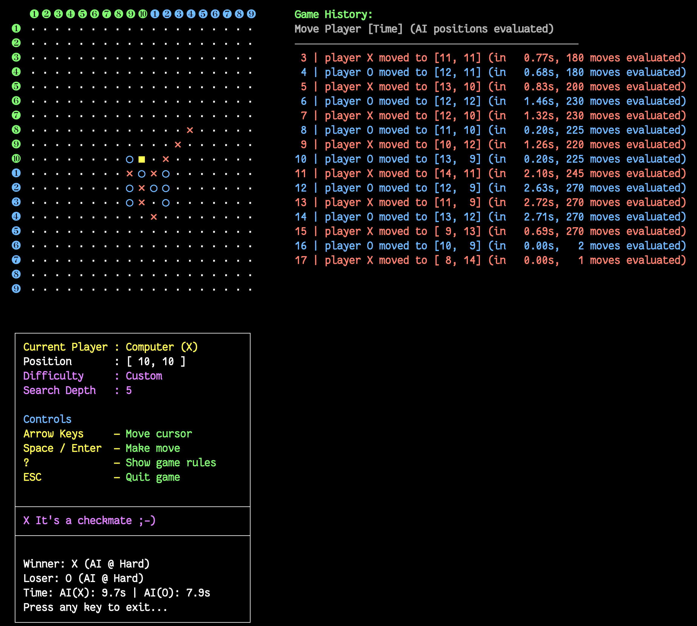
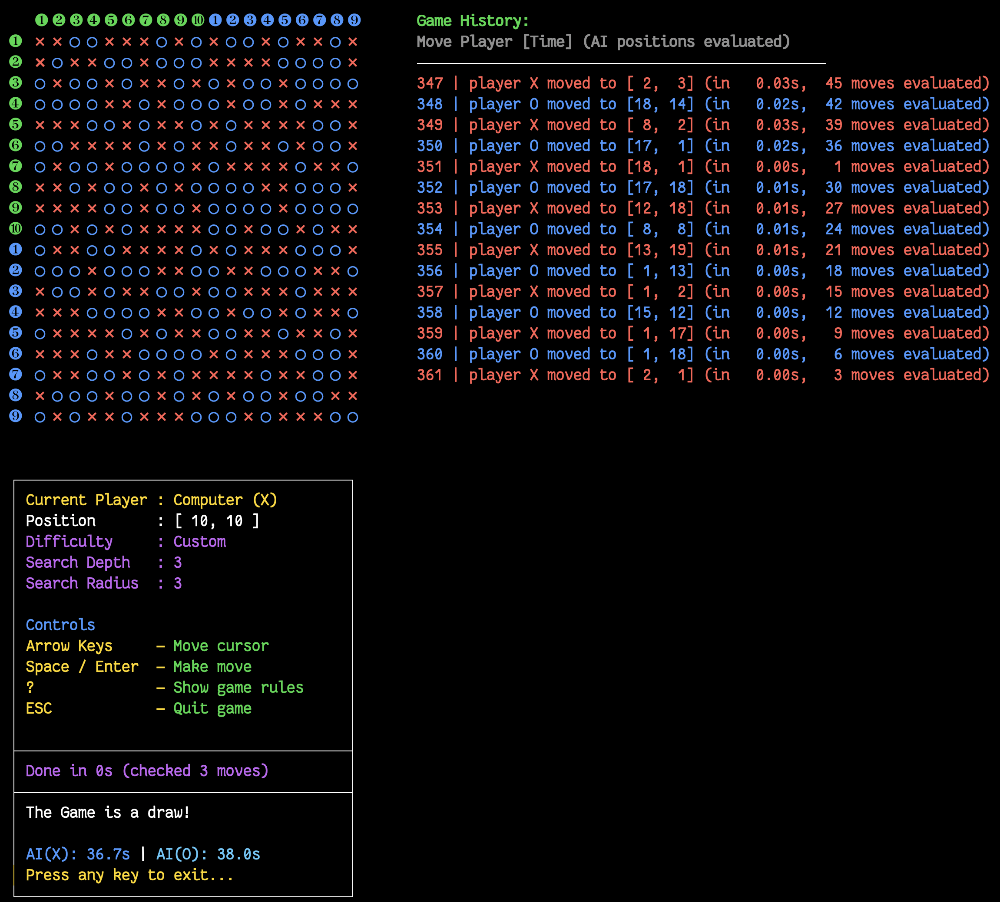
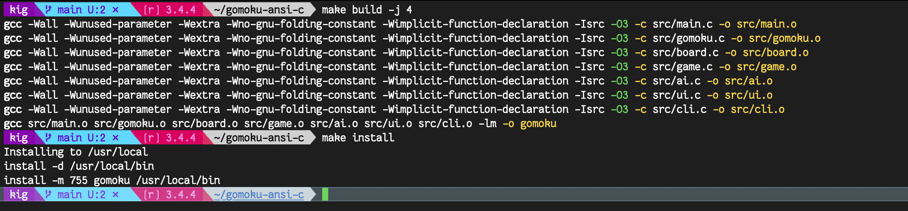
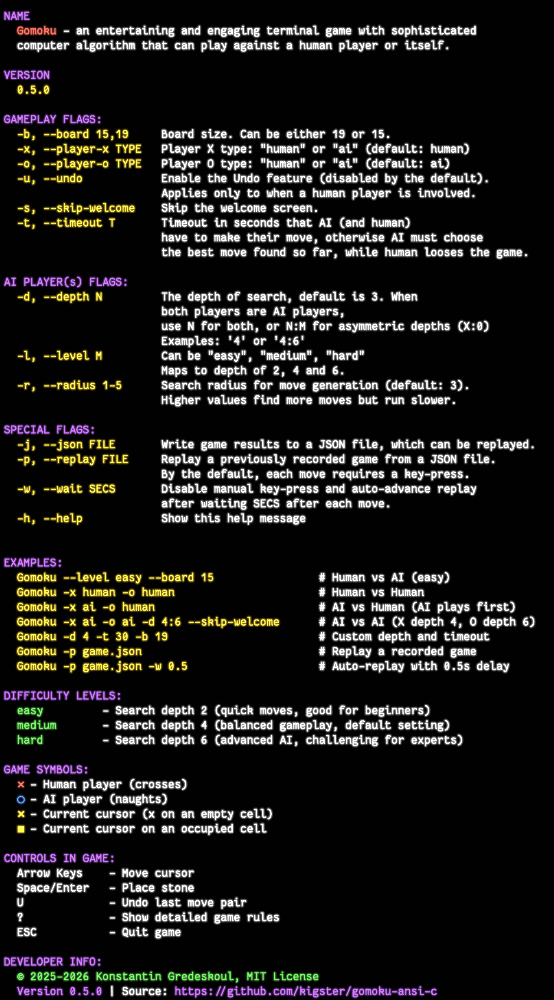

# Gomoku Terminal Game

[](https://github.com/kigster/gomoku-ansi-c/actions/workflows/ci.yml)

## Table of Contents

1. This document: GamePlay, Terminal Usage, Building, CLI.
2. [HTTPD Game Server and the Test Client](doc/HTTPD.md)
3. [Implementation details, modules, and code organization](doc/DEVELOPER.md)

> [!TIP]
> This is an ANSI-C implementation of the Gomoku (Five-in-a-Row) game featuring gameplay against an AI opponent, AI vs AI, or Human vs Human.
>
> The AI algorithm supports flexible search depth and utilizes MiniMax algorithm with Alpha-Beta pruning, and many additional optimizations.
>
> If you are interested in a theory of Gomoku game-play and various approaches to algorithmic AI, we refer you to the [summary of various scientific publications on the subject](.artifacts/README.md).

This game was popular in the former Soviet Union, but it was called "crosses and naughts" (крестики и нолики). Other variations exist called [Renju](https://en.wikipedia.org/wiki/Renju), which attempt to balance the well known fact of the first move advantage in Gomoku.

In this implementation, the default first player is a human, so you will have a default advantage unless you swap with AI using `-x` and `-o` flags.

> [!IMPORTANT]
> This project was developed in collaboration with Claude Code, OpenAI Codex, while the original **evaluation function** was written and heavily tuned by the author as early as 2010.

> [!NOTE]
> Any mention of "playing against the AI" does not imply gameplay against LLMs, or any other form of 'true' artificial intelligence. Here, by "AI Player" we simply mean that a given player is the computer algorithm.

## Introduction

> [!NOTE]
> For detailed breakdown of the source files and their functions we refer to the [Developer Documentation](doc/DEVELOPER.md) document.

### The Two Versions of the Game

This repo contains what can be thought or ae two separate versions of the gamw
that share some code, but built into two separate executablee:

- The first is the single player (or two hunan players, or AI vs AI) for your terminal, works particularly well in iTerm. this game's binary us `gomoku` and running it with `-h` will provide you with all the info you need. Not to mention sections below. This game is written in ANSI C99, is single threaded, and can capture the game into a JSON file.
  
- The second executable is `gomoku-httpd` — a network daemon that shares some code with the Terminal version, except its completely stateless. It receives the game state via JSON that makes it cleanr whose move is the next, so the daemon responds with nearly identical JSON that includes one more move.
  - because each daemon is single threaded its meant to be run as a swarm behind a reverse proxy such `haproxy`.
 


The above picture shows the cluster architecture from the point of view of a sequence diagram. 

### Completed Game Screenshot

Here is the screenshot of a game where a human player prevailed against the "AI Player" on a "hard mode" (with depth of 6).

#### Game Example: Human vs AI

As you'll see down below, the default gameplay is for a human to start with X, and AI player to respond with a O.


#### Game Example: AI vs AI

Using CLI flags you can make the game engine play against itself. Below is the screenshot of AI playing against itself, and both sides play on the same difficulty (i.e. they can scan the board into the same number of future possible moves — 6).



#### Another Example: AI vs AI Resulting in a Draw



## Compiling the Game

It should be trivial to compile the game on any system with a `make` utility and a `C` compiler:

```bash
# Build the game
make build -j 4
# Install `gomoku` binary into /usr/local/bin
make install
```



### Running the Tests

```bash
make test
```


### Alternatively — Using `cmake`

Using CMake:

```bash
make cmake-build cmake-test
```

## Game Features

### Help Screen

```bash
gomoku -h
```

See the following screenshot for an example:



### All Features

- **Interactive Console Interface**: Unicode-based board display with keyboard controls
- **Choose Human vs Human, Human vs AI, AI vs AI, or AI vs Human** — any permutation is supported.
- **AI Opponent**: Intelligent AI using MiniMax algorithm with Alpha-Beta pruning
- **Configurable Difficulty**: Easy, Medium, and Hard levels with different search depths
- **Timeout Support**: Optional move time limits for both human and AI players
- **Undo Functionality**: Undo the last move pair (only works when at least one player is Human)
- **Cross-platform**: Works on Linux, macOS, and other Unix-like systems
- **Comprehensive Testing**: Full test suite using Google Test framework
- **Save the Entire Game to a JSON file**: Complete information bout the game and its progress can be saved into a JSON file with `-j FILE` flag.
- **Replay previously recorded game from a JSON file** which you can do by either manually advancing each move, or providing `-w SECS` (where SECS can be fractional) which is the delay between auto-playing of the moves.

### Game Rules

Gomoku is a strategy game where players take turns placing stones on a board. The goal is to be the first to get five stones in a row (horizontally, vertically, or diagonally).

- **X plays first** (by default X is a human player). First player has a slight advantage.
- **O plays next** (by default AI plays ○)
- **Win condition**: First to get exactly 5 in a row wins
- **Overline rule**: Six or more stones in a row do NOT count as a win

---

## Getting Started

### Prerequisites

- **GCC compiler** (or any C compiler)
- **Make** build system
- **Git** (for downloading Google Test framework)
- **CMake** (optional, for CMake-based builds)

### Quick Setup

For first-time setup, run the automated setup script that installs dependencies and sets up Google Test:

```bash
# Clone the repository
git clone \
  https://github.com/kigster/gomoku-ansi-c.git
cd gomoku-ansi-c

# Run the test setup script manually (not necessary)
# This script is ran automatically via the Makefile
./tests-setup
```

### Building the Game

#### Using Make (Traditional)

```bash
# Clean build files if needed
make clean

# Build the game
make build -j 4
```

#### Using CMake (Alternative)

```bash
# Build using CMake (creates build directory and runs cmake ..)
make cmake-build

# Run tests using CMake
make cmake-test

# Clean CMake build directory
make cmake-clean

# Rebuild from scratch
make cmake-rebuild
```

---

## Game Play

### Quick Start

```bash
# Run with default settings (Medium difficulty, 19x19 board)
# Human is X, AI is O. 
gomoku

# Run with easy difficulty on a 15x15 board
gomoku --level easy --board 15

# Run with custom search depth and timeout
gomoku --depth 6 --timeout 30

# Show all available options
gomoku --help
```

### Switching Players

This game supports all four permitations of who is playing what:

1. **(Default) Human starts as X, AI responds with O**
1. **Human vs Human (taking turns controlling cursor)**
1. **AI starts as X, human follows with O.**
1. **AI plays as X, against AI as O**. In this mode its possible to set different depth levels for each AI using the following syntax: --depth N:M where N is the search depth of X, and M is the search depth of O.

To choose a non default configuration, use the `-x` and `-o` flags which can each receive an argument of either `ai` or `human`.

```bash
# make AI go first, and use search depth of 5
gomoku -x ai -o human -d 5

# oh watch AI play against itself, but give second AI that
# will play naughts a slightly more look ahead power
gomoku -x ai -o ai -d 4:5 
```

### Other CLI Flags Explained

#### Player Configuration

**`-x, --player-x TYPE`** (default: `human`)
Determines who plays as X (crosses). Use `human` for human player or `ai` for AI opponent.

**`-o, --player-o TYPE`** (default: `ai`)
Determines who plays as O (naughts). Use `human` for human player or `ai` for AI opponent.

Examples:

```bash
gomoku -x human -o ai      # Human (X) vs AI (O) - default
gomoku -x human -o human   # Human vs Human
gomoku -x ai -o human      # AI (X) vs Human (O)
gomoku -x ai -o ai         # AI vs AI
```

#### Difficulty & Search Depth

**`-l, --level M`** (options: `easy`, `medium`, `hard`)

> [!TIP]
> Quick difficulty preset that sets the search depth.
>
> - **easy**: Depth 2 - Very fast, suitable for beginners
> - **medium**: Depth 4 - Balanced, default setting, moderately challenging
> - **hard**: Depth 6 - Slow but very challenging gameplay

```bash
gomoku --level easy    # Quick, beginner-friendly
gomoku --level hard    # Challenging for experienced players
```

> [!TIP]
> **`-d, --depth N`** or **`-d, --depth N:M`**

Manually set the search depth (overrides `--level` if both are specified).

- Single value: Both players use the same depth
- N:M format: X uses depth N, O uses depth M (asymmetric)
- Valid range: 1-10 (higher = stronger AI but slower)

```bash
gomoku -d 4            # Both players search to depth 4
gomoku -d 4:6          # X searches to depth 4, O to depth 6
gomoku -d 6 --level hard  # Depth 6 (depth overrides level)
```

#### Time Management

**`-t, --timeout T`**

Set a maximum time limit (in seconds) for each move. Both human and AI players must make a move within this timeout. If the timeout is exceeded:

- **AI**: Plays the best move found so far
- **Human**: Loses the game (move is not made)

Useful for preventing long wait times during deep AI searches.

```bash
gomoku -t 30           # 30-second time limit per move
gomoku -d 6 -t 5       # Deep search (depth 6) with 5-second limit
```

#### Board Configuration

**`-b, --board SIZE`** (options: `15`, `19`)

Choose the board size. The standard Gomoku board is 19x19, but 15x15 is also available for faster games.

```bash
gomoku --board 15      # Smaller board, faster games
gomoku --board 19      # Standard Gomoku board (default)
```

#### Features

**`-u, --undo`**

Enable the undo feature, allowing players to undo the last move pair (human move + AI response). Disabled by default.

```bash
gomoku -u              # Enable undo feature
gomoku --level easy -u # Easy with undo enabled
```

**`-s, --skip-welcome`**

Skip the welcome screen and start the game immediately.

```bash
gomoku -s              # Skip welcome screen
gomoku -x ai -o ai -s  # AI vs AI without welcome
```

**`-h, --help`**

Display the help message and exit.

```bash
gomoku --help          # Show this help
```

### Game Controls

| Key           | Action                                 |
| ------------- | -------------------------------------- |
| **Arrow Keys**| Move cursor around the board           |
| **Space**     | Place a stone at cursor position       |
| **Enter**     | Place a stone at cursor position       |
| **U**         | Undo last move pair (human + AI)       |
| **?**         | Show detailed game rules               |
| **ESC**       | Quit the game                          |

### Difficulty Levels

| Level            | Search Depth | Response Time   | Best For                   |
| ---------------- | ------------ | --------------- | -------------------------- |
| **Easy**         | 2            | < 0.1 seconds   | Beginners, casual play     |
| **Intermediate** | 4            | 0.1-0.5 seconds | Default, balanced gameplay |
| **Hard**         | 6            | 0.5-3 seconds   | Challenging, advanced play |

### Common Usage Patterns

**Beginner-friendly game:**

```bash
gomoku --level easy --board 15 -u
```

**Standard competitive game:**

```bash
gomoku --level medium
```

**Challenge mode:**

```bash
gomoku --level hard --depth 8
```

**AI vs AI demonstration:**

```bash
gomoku -x ai -o ai -d 4:6 --skip-welcome
```

**Testing with time constraints:**

```bash
gomoku -d 6 -t 10 --board 19
```

**Human vs Human game:**

```bash
gomoku -x human -o human -u --board 15
```

---

## Developer Information

### Architecture Overview

The project follows a modular architecture with clear separation of concerns:

```
src/
├── main.c      # Simple orchestrator (105 lines)
├── gomoku.c/.h # Core evaluation functions
├── board.c/.h  # Board management and coordinate utilities
├── game.c/.h   # Game logic and state management
├── ai.c/.h     # AI module with minimax search
├── ui.c/.h     # User interface and display
└── cli.c/.h    # Command-line argument parsing
```

### AI Algorithm Implementation

#### MiniMax with Alpha-Beta Pruning

- **Search Algorithm**: MiniMax with alpha-beta pruning for optimal performance
- **Evaluation Function**: Pattern-based position assessment using threat matrices
- **Timeout Support**: Configurable time limits with graceful degradation
- **Smart Move Ordering**: Prioritizes winning moves and threats for better pruning

#### Pattern Recognition System

The AI recognizes various threat patterns with weighted scoring:

| Pattern             | Score     | Description                   |
| ------------------- | --------- | ----------------------------- |
| **Five in a row**   | 1,000,000 | Winning position              |
| **Straight four**   | 50,000    | Immediate win threat          |
| **Three in a row**  | 1,000     | Strong threat                 |
| **Broken patterns** | 100-500   | Partial threats with gaps     |
| **Combinations**    | Bonus     | Multiple simultaneous threats |

#### Search Space Optimization

- **Proximity-based Search**: Only considers moves within 3 cells of existing stones
- **Early Game Optimization**: Focuses on center area when board is empty
- **First Move Randomization**: AI's first move placed randomly 1-2 squares from human's move
- **Performance Boost**: Reduces search space from 361 to ~20-50 moves per turn

### Testing Framework

The project includes a comprehensive test suite with 20 test cases using Google Test:

```bash
# Build and run all tests
make test

# Test categories covered:
# - Board creation and coordinate utilities
# - Move validation and game state management
# - Win detection in all directions (horizontal, vertical, diagonal)
# - Pattern recognition and threat analysis
# - Evaluation function accuracy
# - MiniMax algorithm functionality
# - Undo functionality and edge cases
```

#### Test Results

- ✅ **20/20 tests passing**
- ✅ Board initialization and management
- ✅ Win detection in all directions
- ✅ Pattern recognition and threat analysis
- ✅ Evaluation functions and AI logic
- ✅ Game state management and undo functionality

### Performance Metrics

| Difficulty | Search Depth | Avg Response Time | Positions Evaluated |
| ---------- | ------------ | ----------------- | ------------------- |
| Easy       | 2            | < 0.1 seconds     | ~10-25              |
| Medium     | 4            | 0.1-0.5 seconds   | ~50-200             |
| Hard       | 6            | 0.5-3 seconds     | ~200-800            |

**Key Optimizations:**

- **Move Ordering**: 3-5x faster with intelligent priority sorting
- **Incremental Evaluation**: Only evaluates positions near the last move
- **Alpha-Beta Pruning**: Reduces effective branching factor significantly
- **Early Termination**: Immediately selects winning moves

### Core Functions

#### Game Logic (`game.c`)

- `init_game()`: Initialize game state and board
- `make_move()`: Validate and execute player moves
- `undo_last_moves()`: Undo functionality for move pairs
- `start_move_timer()` / `end_move_timer()`: Timing system

#### AI Engine (`ai.c`)

- `find_best_ai_move()`: Main AI move selection with timeout support
- `minimax_with_timeout()`: MiniMax algorithm with time limits
- `get_move_priority()`: Move ordering for alpha-beta optimization
- `is_winning_move()`: Immediate win detection

#### Evaluation System (`gomoku.c`)

- `evaluate_position()`: Main board evaluation function
- `calc_score_at()`: Threat analysis for individual positions
- `has_winner()`: Win condition detection in all directions
- `populate_threat_matrix()`: Initialize pattern recognition system

### Algorithm Complexity

- **Time Complexity**: O(b^d) where b is branching factor and d is depth
- **Space Complexity**: O(d) for recursion stack
- **Optimization**: Alpha-beta pruning reduces effective branching factor from ~30 to ~5-10

---

## License & Copyright

This project is © Konstantin Gredeskoul, 2025-2026. It is open source and can be distributed under the MIT License.

## Contributing

Contributions are welcome! Please feel free to submit issues, feature requests, or pull requests.

## Acknowledgments

- Pattern recognition algorithms adapted from traditional Gomoku AI techniques
- Google Test framework for comprehensive testing
- Unicode characters for enhanced visual display
- Claude (Sonet, Opus, Haiku) for being a great pair programmer.
- OpenAI (codex) for fixing some performance bugs.
