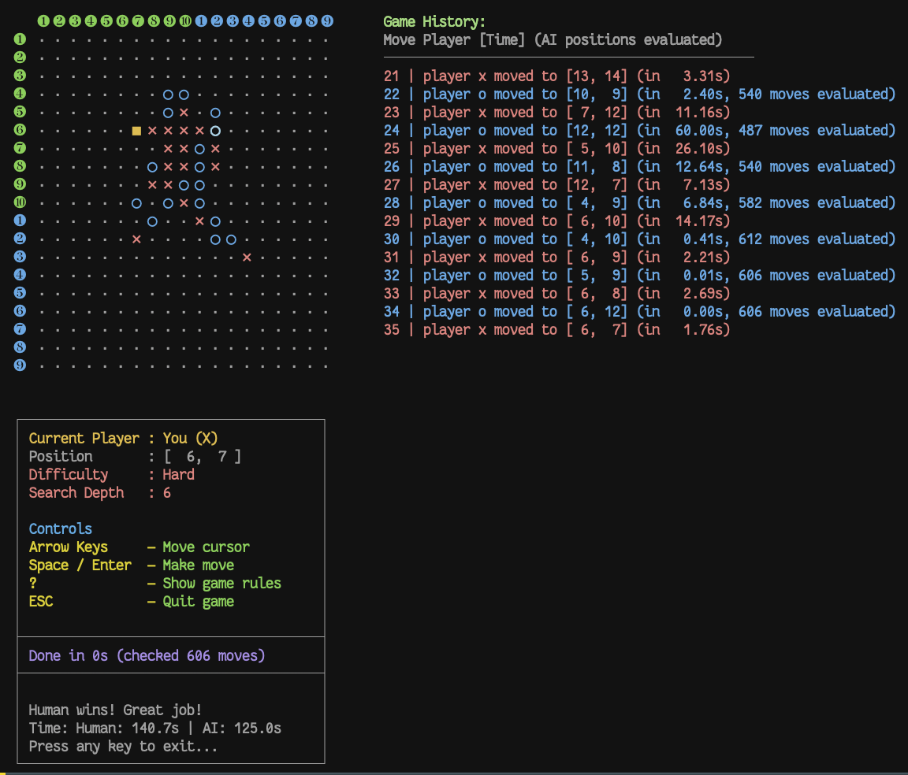
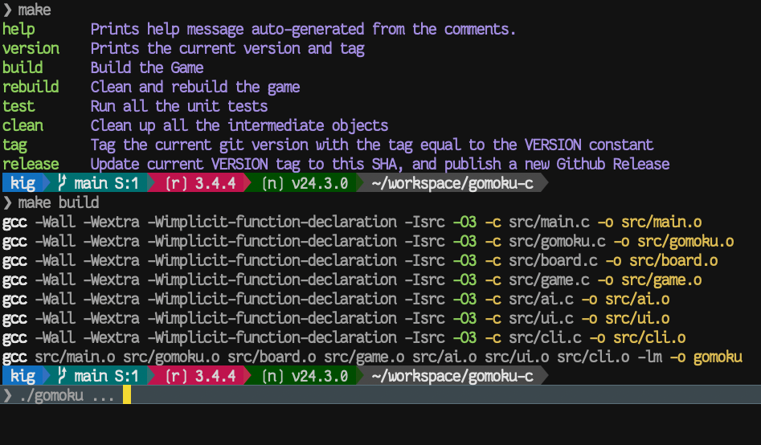
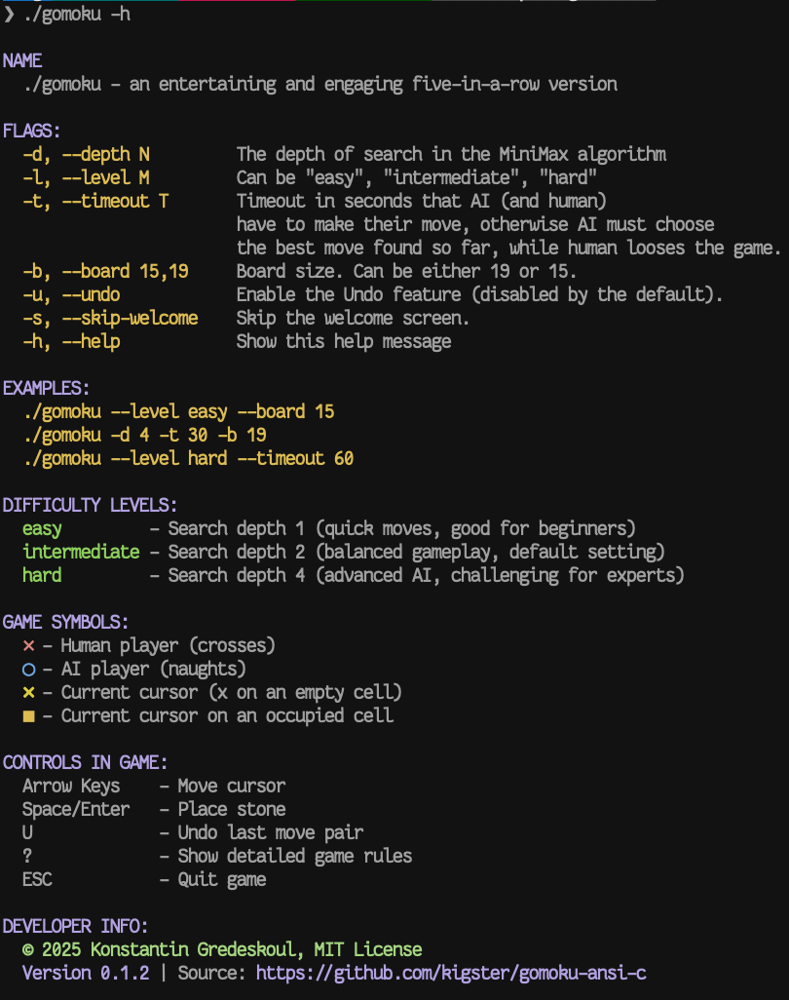

# Gomoku Game - C Implementation

[](https://github.com/kigster/gomoku-ansi-c/actions/workflows/ci.yml)

A C implementation of the Gomoku (Five-in-a-Row) game featuring an AI opponent using the MiniMax algorithm with Alpha-Beta pruning.

> [!TIP]
> This project was produced in collaboration with Claude-4-MAX, but the original **evaluation function** was written by the author. Also, when we say "playing with AI" we do not mean LLMs, we simply mean you are playing against the computer.

You can read Claude's analysis of it in the [Overview](OVERVIEW.md) file.

### Completed Game Screenshot

Here is the game where the human player prevailed, although it is exceedingly difficult to win even on Medium setting, which only looks ahead a few moves.

> [!NOTE]
> This game was popular in the former Soviet Union, but it was called "crosses and naughts" (крестики и нолики).

#### Game Example (Hard Mode, Human Wins)

> [!TIP]
> These timings were possible only after additional optimizations were introduced in [this PR](https://github.com/kigster/gomoku-ansi-c/pull/4).



## Building the Game for the Impatient

Here is how to compile and run the game:

```bash
make build -j 4
./gomoku -h
```

## Alternatively

Using CMake:

```bash
make cmake-build cmake-test
./gomoku -h
```

See the following screenshot for an example:



## Features

- **Interactive Console Interface**: Unicode-based board display with keyboard controls
- **AI Opponent**: Intelligent AI using MiniMax algorithm with Alpha-Beta pruning
- **Configurable Difficulty**: Easy, Medium, and Hard levels with different search depths
- **Timeout Support**: Optional move time limits for both human and AI players
- **Undo Functionality**: Undo the last move pair (human + AI)
- **Cross-platform**: Works on Linux, macOS, and other Unix-like systems
- **Comprehensive Testing**: Full test suite using Google Test framework

## Game Rules

Gomoku is a strategy game where players take turns placing stones on a board. The goal is to be the first to get five stones in a row (horizontally, vertically, or diagonally).

- **X plays first** (by default X is a human player). First player has a slight advantage.
- **O plays next** (by default AI plays ○)
- **Win condition**: First to get exactly 5 in a row wins
- **Overline rule**: Six or more stones in a row do NOT count as a win

---

## Getting Started

### Prerequisites

- **GCC compiler** (or any C compiler)
- **Make** build system
- **Git** (for downloading Google Test framework)
- **CMake** (optional, for CMake-based builds)

### Quick Setup

For first-time setup, run the automated setup script that installs dependencies and sets up Google Test:

```bash
# Clone the repository
git clone https://github.com/kigster/gomoku-ansi-c.git
cd gomoku-ansi-c

# Run setup script (installs dependencies and Google Test)
make test
```

### Building the Game

#### Using Make (Traditional)

```bash
# Clean build files if needed
make clean

# Build the game
make build -j 4
```

#### Using CMake (Alternative)

```bash
# Build using CMake (creates build directory and runs cmake ..)
make cmake-build

# Run tests using CMake
make cmake-test

# Clean CMake build directory
make cmake-clean

# Rebuild from scratch
make cmake-rebuild
```

### Help Screen

Below is the screenshot of the help screen of the game, since it's a CLI/Terminal game.



---

## GAMEPLAY

### Quick Start

```bash
# Run with default settings (Medium difficulty, 19x19 board)
# Human is X, AI is O. 
./gomoku

# Run with easy difficulty on a 15x15 board
./gomoku --level easy --board 15

# Run with custom search depth and timeout
./gomoku --depth 6 --timeout 30

# Show all available options
./gomoku --help
```

### Switching Players

This game supports all four permitations of who is playing what:

1. (Default) Human starts as X, AI responds with O
1. Human vs Human (taking turns controlling cursor)
1. AI starts as X, human follows with O.
1. AI plays as X, against AI as O. In this mode its possible to set different depth levels for each AI using the following syntax: --depth N:M where N is the search depth of X, and N is the search depth of O.

To choose a non default configuration, simply pass:

```bash
# make AI go first, and use search depth of 5
./gomoku -x ai -o human -d 5

# oh watch AI play against itself, but give second AI that
# will play naughts a slightly more look ahead power
./gomoku -x ai -o ai -d 4:5 
```

### Complete Help Output

```
NAME
  ./gomoku - an entertaining and engaging five-in-a-row version

FLAGS:
  -x, --player-x TYPE   Player X type: "human" or "ai" (default: human)
  -o, --player-o TYPE   Player O type: "human" or "ai" (default: ai)
  -d, --depth N         The depth of search. Use N for both, or N:M for
                        asymmetric depths (X:O). Examples: '4' or '4:6'
  -l, --level M         Can be "easy", "medium", "hard"
  -t, --timeout T       Timeout in seconds that AI (and human)
                        have to make their move, otherwise AI must choose
                        the best move found so far, while human looses the game.
  -b, --board 15,19     Board size. Can be either 19 or 15.
  -u, --undo            Enable the Undo feature (disabled by the default).
  -s, --skip-welcome    Skip the welcome screen.
  -h, --help            Show this help message

EXAMPLES:
  ./gomoku --level easy --board 15                # Human vs AI (easy)
  ./gomoku -x human -o human                      # Human vs Human
  ./gomoku -x ai -o human                         # AI vs Human (AI plays first)
  ./gomoku -x ai -o ai -d 4:6 --skip-welcome      # AI vs AI (X depth 4, O depth 6)
  ./gomoku -d 4 -t 30 -b 19                       # Custom depth and timeout

DIFFICULTY LEVELS:
  easy         - Search depth 2 (quick moves, good for beginners)
  medium       - Search depth 4 (balanced gameplay, default setting)
  hard         - Search depth 6 (advanced AI, challenging for experts)

GAME SYMBOLS:
  ✕ - Human player (crosses)
  ○ - AI player (naughts)
  ✕ - Current cursor (x on an empty cell)
  ◼︎ - Current cursor on an occupied cell

CONTROLS IN GAME:
  Arrow Keys    - Move cursor
  Space/Enter   - Place stone
  U             - Undo last move pair
  ?             - Show detailed game rules
  ESC           - Quit game
```

### Command Line Options Explained

#### Player Configuration

**`-x, --player-x TYPE`** (default: `human`)
Determines who plays as X (crosses). Use `human` for human player or `ai` for AI opponent.

**`-o, --player-o TYPE`** (default: `ai`)
Determines who plays as O (naughts). Use `human` for human player or `ai` for AI opponent.

Examples:
```bash
./gomoku -x human -o ai      # Human (X) vs AI (O) - default
./gomoku -x human -o human   # Human vs Human
./gomoku -x ai -o human      # AI (X) vs Human (O)
./gomoku -x ai -o ai         # AI vs AI
```

#### Difficulty & Search Depth

**`-l, --level M`** (options: `easy`, `medium`, `hard`)

> [!TIP]
> Quick difficulty preset that sets the search depth.
>
> - **easy**: Depth 2 - Very fast, suitable for beginners
> - **medium**: Depth 4 - Balanced, default setting, moderately challenging
> - **hard**: Depth 6 - Slow but very challenging gameplay

```bash
./gomoku --level easy    # Quick, beginner-friendly
./gomoku --level hard    # Challenging for experienced players
```

> [!TIP]
> **`-d, --depth N`** or **`-d, --depth N:M`**

Manually set the search depth (overrides `--level` if both are specified).

- Single value: Both players use the same depth
- N:M format: X uses depth N, O uses depth M (asymmetric)
- Valid range: 1-10 (higher = stronger AI but slower)

```bash
./gomoku -d 4            # Both players search to depth 4
./gomoku -d 4:6          # X searches to depth 4, O to depth 6
./gomoku -d 6 --level hard  # Depth 6 (depth overrides level)
```

#### Time Management

**`-t, --timeout T`**

Set a maximum time limit (in seconds) for each move. Both human and AI players must make a move within this timeout. If the timeout is exceeded:

- **AI**: Plays the best move found so far
- **Human**: Loses the game (move is not made)

Useful for preventing long wait times during deep AI searches.

```bash
./gomoku -t 30           # 30-second time limit per move
./gomoku -d 6 -t 5       # Deep search (depth 6) with 5-second limit
```

#### Board Configuration

**`-b, --board SIZE`** (options: `15`, `19`)

Choose the board size. The standard Gomoku board is 19x19, but 15x15 is also available for faster games.

```bash
./gomoku --board 15      # Smaller board, faster games
./gomoku --board 19      # Standard Gomoku board (default)
```

#### Features

**`-u, --undo`**

Enable the undo feature, allowing players to undo the last move pair (human move + AI response). Disabled by default.

```bash
./gomoku -u              # Enable undo feature
./gomoku --level easy -u # Easy with undo enabled
```

**`-s, --skip-welcome`**

Skip the welcome screen and start the game immediately.

```bash
./gomoku -s              # Skip welcome screen
./gomoku -x ai -o ai -s  # AI vs AI without welcome
```

**`-h, --help`**

Display the help message and exit.

```bash
./gomoku --help          # Show this help
```

### Game Controls

| Key           | Action                                 |
| ------------- | -------------------------------------- |
| **Arrow Keys**| Move cursor around the board           |
| **Space**     | Place a stone at cursor position       |
| **Enter**     | Place a stone at cursor position       |
| **U**         | Undo last move pair (human + AI)       |
| **?**         | Show detailed game rules               |
| **ESC**       | Quit the game                          |

### Difficulty Levels

| Level            | Search Depth | Response Time   | Best For                   |
| ---------------- | ------------ | --------------- | -------------------------- |
| **Easy**         | 2            | < 0.1 seconds   | Beginners, casual play     |
| **Intermediate** | 4            | 0.1-0.5 seconds | Default, balanced gameplay |
| **Hard**         | 6            | 0.5-3 seconds   | Challenging, advanced play |

### Common Usage Patterns

**Beginner-friendly game:**
```bash
./gomoku --level easy --board 15 -u
```

**Standard competitive game:**
```bash
./gomoku --level medium
```

**Challenge mode:**
```bash
./gomoku --level hard --depth 8
```

**AI vs AI demonstration:**
```bash
./gomoku -x ai -o ai -d 4:6 --skip-welcome
```

**Testing with time constraints:**
```bash
./gomoku -d 6 -t 10 --board 19
```

**Human vs Human game:**
```bash
./gomoku -x human -o human -u --board 15
```

---

## Developer Information

### Architecture Overview

The project follows a modular architecture with clear separation of concerns:

```
src/
├── main.c      # Simple orchestrator (105 lines)
├── gomoku.c/.h # Core evaluation functions
├── board.c/.h  # Board management and coordinate utilities
├── game.c/.h   # Game logic and state management
├── ai.c/.h     # AI module with minimax search
├── ui.c/.h     # User interface and display
└── cli.c/.h    # Command-line argument parsing
```

### AI Algorithm Implementation

#### MiniMax with Alpha-Beta Pruning

- **Search Algorithm**: MiniMax with alpha-beta pruning for optimal performance
- **Evaluation Function**: Pattern-based position assessment using threat matrices
- **Timeout Support**: Configurable time limits with graceful degradation
- **Smart Move Ordering**: Prioritizes winning moves and threats for better pruning

#### Pattern Recognition System

The AI recognizes various threat patterns with weighted scoring:

| Pattern             | Score     | Description                   |
| ------------------- | --------- | ----------------------------- |
| **Five in a row**   | 1,000,000 | Winning position              |
| **Straight four**   | 50,000    | Immediate win threat          |
| **Three in a row**  | 1,000     | Strong threat                 |
| **Broken patterns** | 100-500   | Partial threats with gaps     |
| **Combinations**    | Bonus     | Multiple simultaneous threats |

#### Search Space Optimization

- **Proximity-based Search**: Only considers moves within 3 cells of existing stones
- **Early Game Optimization**: Focuses on center area when board is empty
- **First Move Randomization**: AI's first move placed randomly 1-2 squares from human's move
- **Performance Boost**: Reduces search space from 361 to ~20-50 moves per turn

### Testing Framework

The project includes a comprehensive test suite with 20 test cases using Google Test:

```bash
# Build and run all tests
make test

# Test categories covered:
# - Board creation and coordinate utilities
# - Move validation and game state management
# - Win detection in all directions (horizontal, vertical, diagonal)
# - Pattern recognition and threat analysis
# - Evaluation function accuracy
# - MiniMax algorithm functionality
# - Undo functionality and edge cases
```

#### Test Results

- ✅ **20/20 tests passing**
- ✅ Board initialization and management
- ✅ Win detection in all directions
- ✅ Pattern recognition and threat analysis
- ✅ Evaluation functions and AI logic
- ✅ Game state management and undo functionality

### Performance Metrics

| Difficulty | Search Depth | Avg Response Time | Positions Evaluated |
| ---------- | ------------ | ----------------- | ------------------- |
| Easy       | 2            | < 0.1 seconds     | ~10-25              |
| Medium     | 4            | 0.1-0.5 seconds   | ~50-200             |
| Hard       | 6            | 0.5-3 seconds     | ~200-800            |

**Key Optimizations:**

- **Move Ordering**: 3-5x faster with intelligent priority sorting
- **Incremental Evaluation**: Only evaluates positions near the last move
- **Alpha-Beta Pruning**: Reduces effective branching factor significantly
- **Early Termination**: Immediately selects winning moves

### Core Functions

#### Game Logic (`game.c`)

- `init_game()`: Initialize game state and board
- `make_move()`: Validate and execute player moves
- `undo_last_moves()`: Undo functionality for move pairs
- `start_move_timer()` / `end_move_timer()`: Timing system

#### AI Engine (`ai.c`)

- `find_best_ai_move()`: Main AI move selection with timeout support
- `minimax_with_timeout()`: MiniMax algorithm with time limits
- `get_move_priority()`: Move ordering for alpha-beta optimization
- `is_winning_move()`: Immediate win detection

#### Evaluation System (`gomoku.c`)

- `evaluate_position()`: Main board evaluation function
- `calc_score_at()`: Threat analysis for individual positions
- `has_winner()`: Win condition detection in all directions
- `populate_threat_matrix()`: Initialize pattern recognition system

### Algorithm Complexity

- **Time Complexity**: O(b^d) where b is branching factor and d is depth
- **Space Complexity**: O(d) for recursion stack
- **Optimization**: Alpha-beta pruning reduces effective branching factor from ~30 to ~5-10

---

## License & Copyright

This project is © Konstantin Gredeskoul, 2025-2026. It is open source and can be distributed under the MIT License.

## Contributing

Contributions are welcome! Please feel free to submit issues, feature requests, or pull requests.

## Acknowledgments

- Pattern recognition algorithms adapted from traditional Gomoku AI techniques
- Google Test framework for comprehensive testing
- Unicode characters for enhanced visual display
- Claude-4-MAX for being a great pair programmer.
