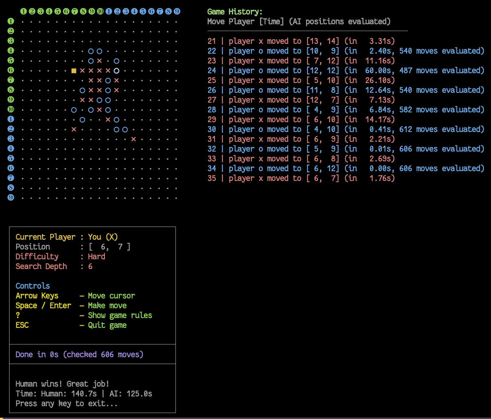

# 01 — Human vs AI in the Terminal (TUI)

The terminal version is a single ANSI-coloured C99 binary with **zero
runtime dependencies**. It runs anywhere a C compiler does — macOS,
Linux, BSD, WSL, or a stripped-down container — and is the fastest way
to feel the engine for yourself.



## Build

```bash
just build-game            # recommended
make -C gomoku-c all install   # equivalent
```

This produces three binaries under `bin/`:

| Binary | Purpose |
|---|---|
| `gomoku` | The interactive TUI |
| `gomoku-httpd` | Stateless JSON daemon (used by the web flow) |
| `gomoku-http-client` | CLI client for the daemon |

## Play

```bash
bin/gomoku                                    # Human (X) vs AI (O), depth 3
bin/gomoku -d 5                               # Harder AI (depth 5)
bin/gomoku -l hard                            # Same as -d 6
bin/gomoku -x ai -o ai -d 3:5                # AI vs AI, asymmetric depths
bin/gomoku -x ai -o ai -d 4 -q -j game.json  # Headless AI game, save to JSON
bin/gomoku -p game.json -w 0.5                # Replay saved game, 0.5 s/move
bin/gomoku -b 19 -r 4 -t 60                  # 19x19 board, radius 4, 60 s timeout
bin/gomoku -i                                 # Show threat hints (blink)
```

Move with the arrow keys; place a stone with `Space` or `Enter`. `u`
undoes (capped at five undos by default; see `--undo-limit`). `q`
quits.

## CLI reference

```text
gomoku [options]

Gameplay:
  -b, --board 15|19    Board size (default: 15)
  -x, --player-x TYPE  human or ai (default: human)
  -o, --player-o TYPE  human or ai (default: ai)
  -u, --undo           Enable undo (default: on)
  -U, --undo-limit N   Max undo moves per game (default: 5, 0 = unlimited)
  -s, --skip-welcome   Skip the welcome screen
  -i, --hints          Highlight threatening patterns with blink
  -t, --timeout T      Seconds per move (AI picks best so far; human forfeits)

AI:
  -d, --depth N        Search depth 1-10 (or N:M for asymmetric X:O)
  -l, --level NAME     easy (2), medium (4), hard (6)
  -r, --radius 1-5     Move-generation radius (default: 3)

Recording:
  -j, --json FILE      Save game to JSON
  -p, --replay FILE    Replay a saved game
  -w, --wait SECS      Auto-advance replay (default: wait for keypress)
  -q, --quiet          Headless mode (AI vs AI, JSON output only)
  -h, --help           Show help
```

## Knobs that actually matter

The two AI knobs that change strength the most are `--depth` and
`--radius`:

- **`--depth` (1–10)** — alpha-beta look-ahead in plies. Each extra
  ply roughly squares the candidate space; `-d 3` is "casual club
  player" and `-d 6` is what most humans struggle to beat. The
  `--level` flag is just a friendly name (`easy=2`, `medium=4`,
  `hard=6`).
- **`--radius` (1–5)** — how far around the existing stones the
  candidate-move generator looks. Radius 1 is myopic (only adjacent
  intersections); radius 3 is balanced and the default; radius 5 lets
  the engine consider moves that set up long-range double-threes but
  searches a much larger fan-out.
- **`--timeout`** — wall-clock cap per move. The AI picks the best
  move it has so far when the clock fires; humans forfeit if they
  exceed it.

A good first match: `bin/gomoku -d 4 -r 3 -t 30` — competent but
playable.

## Recording, replay, AI vs AI

`-j FILE` saves every move to a JSON file with the same shape the
daemon and the web frontend speak. `-p FILE` replays a saved game,
optionally on a per-move timer (`-w`) for AI-vs-AI viewing.

`-q` flips the binary into headless mode for tournament-style work:
both sides become AI, no UI is drawn, and the final position + winner
prints to stdout as JSON (perfect for shell pipelines).

## Evaluations

The repo ships a small evaluation harness so you can quantify a tweak
to the engine:

```bash
just evals              # tactical positions + depth tournament
just eval-tactical      # tactical positions only
just eval-tournament    # AI vs AI across depths 2,3,4
just evals-ruby         # Ruby tournament against the httpd cluster
```

`just eval-llm` runs an LLM-judged evaluation (requires
`ANTHROPIC_API_KEY`). See `gomoku-c/tests/evals/` for the test
positions and runner scripts.

## See also

- [doc/ai-engine.md](ai-engine.md) — algorithm details, threat
  scoring, known issues.
- [doc/game-rules.md](game-rules.md) — Gomoku/Renju rules and the
  variants we plan to support.
