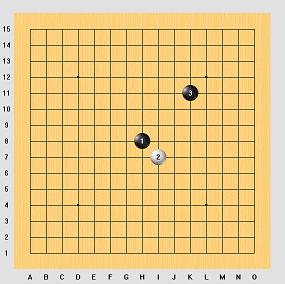
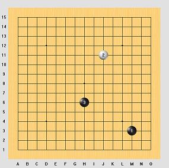
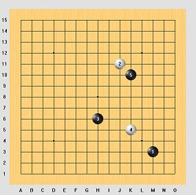

# Gomoku & Renju — Complete Rules Reference

> **Sources**: [VCPR Gomoku Rules](http://www.vcpr.cz/en/help-and-rules/gomoku-rules/) | [VCPR Renju Rules](http://www.vcpr.cz/en/help-and-rules/renju-rules/) | [RenjuNet — What is Renju?](https://www.renju.net/rules/) | [RenjuNet — International Rules](https://www.renju.net/rifrules/) | [RenjuNet — Advanced Tutorial](https://www.renju.net/advanced/) | [RenjuNet — Starting the Game](https://www.renju.net/starting/) | [RenjuNet — 26 Openings](https://www.renju.net/openings/) | [Gambiter — Gomoku](https://gambiter.com/renju/Gomoku.html)

---

## Table of Contents

1. [Overview](#1-overview)
2. [Equipment](#2-equipment)
3. [Basic Concepts](#3-basic-concepts)
   - [Rows, Threes, Fours, and Forks](#rows-threes-fours-and-forks)
4. [Gomoku Variants](#4-gomoku-variants)
   - [Freestyle Gomoku](#41-freestyle-gomoku)
   - [Standard Gomoku](#42-standard-gomoku)
   - [Gomoku Pro](#43-gomoku-pro)
   - [Gomoku Swap](#44-gomoku-swap)
   - [Gomoku Swap2](#45-gomoku-swap2)
   - [Caro (Gomoku+)](#46-caro-gomoku)
   - [Omok](#47-omok)
   - [Ninuki-Renju / Pente](#48-ninuki-renju--pente)
   - [Connect6](#49-connect6)
5. [Renju](#5-renju)
   - [How Renju Differs from Gomoku](#51-how-renju-differs-from-gomoku)
   - [Forbidden Moves for Black](#52-forbidden-moves-for-black)
   - [Advanced Forbidden Move Analysis](#53-advanced-forbidden-move-analysis)
   - [Win Conditions](#54-win-conditions)
   - [Draw Conditions](#55-draw-conditions)
6. [Opening Procedures](#6-opening-procedures)
   - [Gomoku Openings](#61-gomoku-openings)
   - [Renju Openings — The 26 Canonical Patterns](#62-renju-openings--the-26-canonical-patterns)
   - [RIF Opening Rule (Classic)](#63-rif-opening-rule-classic)
   - [Yamaguchi Opening Rule (2009–2015)](#64-yamaguchi-opening-rule-20092015)
   - [Soosyrv-8 Opening Rule (2017–2023)](#65-soosyrv-8-opening-rule-20172023)
   - [Taraguchi-10 Opening Rule (2024–present)](#66-taraguchi-10-opening-rule-2024present)
7. [Time Control and Tournament Rules](#7-time-control-and-tournament-rules)
8. [First-Player Advantage](#8-first-player-advantage)
9. [Glossary](#9-glossary)

---

## 1. Overview

**Gomoku** (五目並べ, *gomokunarabe*) is an abstract strategy board game for two players, also known as "Five in a Row." Originating in China as **Wu Zi Qi** (五子棋), the game spread to Japan, Korea (where it is called **Omok**, 오목), and eventually worldwide. In some countries it is informally known as "crosses and noughts."

**Renju** is the professional, tournament-grade evolution of Gomoku, developed by Japanese masters approximately 100 years ago. It adds restrictions on Black's play to counterbalance the significant first-player advantage discovered in unrestricted Gomoku.

Both games share the same fundamental objective: **be the first to form an unbroken line of five stones of your color** — horizontally, vertically, or diagonally.

---

## 2. Equipment

### Board

| Property       | Standard          | Notes                              |
|----------------|-------------------|------------------------------------|
| Material       | Wood (traditional)| Any flat surface with grid         |
| Grid size      | **15 x 15**       | Standard for Renju and tournament Gomoku |
| Alternate size | 19 x 19           | Traditional (historical), used in some Gomoku variants |
| Reference points| 5 marked intersections | Center + 4 star points        |
| Color          | Must differ from stone colors | Typically light wood      |

### Stones

| Property | Description                                    |
|----------|------------------------------------------------|
| Colors   | Black and White                                |
| Material | Plastic, glass, or ceramic (traditional: slate & clamshell) |
| Placement| **On intersections**, not inside squares        |

### Time Control

- Chess clocks are used in tournament play
- Standard tournament time: **10 minutes per player per game**
- See [Section 7](#7-time-control-and-tournament-rules) for detailed rules

---

## 3. Basic Concepts

### Rows, Threes, Fours, and Forks

Understanding these structures is essential for both Gomoku and Renju.

#### Row

A combination of same-colored stones on a diagonal, vertical, or horizontal line, bounded by board edges, opponent stones, or empty intersections, with no opponent stones interspersed.

#### Unbroken Row

A row where there are no empty intersections between any of the stones.

#### Five in a Row

An unbroken row of exactly five stones. This is the **winning condition**.

#### Overline

An unbroken row of **six or more** stones. Treatment varies by variant:

| Variant          | Overline Rule                          |
|------------------|----------------------------------------|
| Freestyle Gomoku | Counts as a win                        |
| Standard Gomoku  | Does **not** count; game continues     |
| Renju (Black)    | **Forbidden** — Black loses            |
| Renju (White)    | Counts as a win                        |

#### Four

A row of four stones where one more stone can be added to make five in a row.

```
  Open Four (straight four):     ○ ● ● ● ● ○      Win — cannot be blocked
  Half-Open Four:                ○ ● ● ● ● ■      Can be blocked at one end
```

An **open four** (also called a **straight four**) can become five from **either** end — this is effectively an unstoppable win, since the opponent can only block one end.

A **half-open four** can become five from only **one** end and can be defended.

#### Three

A row of three stones that can, in one move, become a **straight four** (open four) without simultaneously creating a five.

```
  Open Three:     ○ ● ● ● ○ ○     Can become an open four
  Closed Three:   ■ ● ● ● ○ ○     Cannot become an open four
```

An **open three** is dangerous because it leads to an open four, which is effectively a guaranteed win if left unblocked.

#### Forks (Double Attacks)

A **fork** is a single move that creates two simultaneous threats. Fork types:

| Fork Type | Notation | Description | Winning? |
|-----------|----------|-------------|----------|
| Double Four   | 4×4 | Creates two fours simultaneously       | Yes — cannot block both |
| Four-Three    | 4×3 | Creates one four and one open three    | Yes — must block the four, three becomes open four |
| Double Three  | 3×3 | Creates two open threes simultaneously | Yes — blocking one leaves the other |

**In Renju**, Black's only legal winning fork is the **4×3 fork**. The 4×4 and 3×3 forks are forbidden for Black (see [Section 5.2](#52-forbidden-moves-for-black)).

Complex forks with more than two lines (e.g., 3×3×3, 4×4×4, 4×4×3, 4×3×3) are all **forbidden for Black** in Renju. The only legal fork for Black is exactly one four and one open three.

---

## 4. Gomoku Variants

### 4.1 Freestyle Gomoku

The simplest form with **no restrictions** on either player.

| Rule                | Detail                                    |
|---------------------|-------------------------------------------|
| Board               | 15×15 (or 19×19)                          |
| First player        | Black                                     |
| Win condition       | Five **or more** stones in a row          |
| Overlines           | Count as a win                            |
| Restrictions        | None                                      |
| Opening rule        | None                                      |

**Note**: With perfect play, Black always wins on a 15×15 board (proven by L. Victor Allis).

---

### 4.2 Standard Gomoku

Adds the overline restriction to Freestyle.

| Rule                | Detail                                    |
|---------------------|-------------------------------------------|
| Board               | 15×15                                     |
| First player        | Black                                     |
| Win condition       | **Exactly** five stones in a row          |
| Overlines           | Do **not** count — game continues         |
| Restrictions        | None beyond overline rule                 |
| Opening rule        | None                                      |

---

### 4.3 Gomoku Pro

An opening rule that restricts the first three moves to reduce Black's advantage.

| Rule                | Detail                                    |
|---------------------|-------------------------------------------|
| Board               | 15×15                                     |
| Win condition       | Exactly five in a row (overlines don't count) |
| Move 1 (Black)      | **Must** be placed at the center (H8)     |
| Move 2 (White)      | **Must** be adjacent to the first stone (max 8 possible positions) |
| Move 3 (Black)      | **Must** be at least **3 intersections** from the center |
| After move 3        | Normal alternating play, no restrictions  |

#### Opening Moves — Gomoku Pro

The PRO opening constrains the first three moves to balance the game:

```
     A B C D E F G H I J K L M N O
 15  . . . . . . . . . . . . . . .
 14  . . . . . . . . . . . . . . .
 13  . . . . . . . . . . . . . . .
 12  . . . . . . . . . . . . . . .
 11  . . . . . . . . . . . . . . .
 10  . . . . . . . . . . . . . . .
  9  . . . . . . . . . . . . . . .
  8  . . . . . . . ● . . . . . . .     ← Move 1: Black at center (H8)
  7  . . . . . . . . . . . . . . .
  6  . . . . . . . . . . . . . . .
  5  . . . . . . . . . . . . . . .       Move 2: White adjacent to H8
  4  . . . . . . . . . . . . . . .       Move 3: Black ≥3 away from center
  3  . . . . . . . . . . . . . . .
  2  . . . . . . . . . . . . . . .
  1  . . . . . . . . . . . . . . .
```

*There is also a **Long Pro** variant where the third stone must be at least **4** intersections from center.*



---

### 4.4 Gomoku Swap

Uses the "pie rule" to balance the opening.

| Rule                | Detail                                    |
|---------------------|-------------------------------------------|
| Board               | 15×15                                     |
| Win condition       | Exactly five in a row (overlines don't count) |
| Opening             | See procedure below                       |

#### Opening Procedure — Swap

1. The first player places **three stones** (2 Black, 1 White) anywhere on the board.
2. The second player **chooses which color** they want to play for the rest of the game.
3. Normal play continues from the chosen positions.

The first player is incentivized to create a **balanced** position with the three stones, since the opponent will pick the color with the better position.

```
     A B C D E F G H I J K L M N O
 15  . . . . . . . . . . . . . . .
 14  . . . . . . . . . . . . . . .
 13  . . . . . . . . . . . . . . .
 12  . . . . . . . . . . . . . . .
 11  . . . . . . . . . . . . . . .
 10  . . . . . . . . . . . . . . .
  9  . . . . . . . . . . . . . . .
  8  . . . . . . . . . . . . . . .
  7  . . . . . . ● . . . . . . . .     Example Swap opening:
  6  . . . . . . . . . . . . . . .       ● Black stones (moves 1 & 3)
  5  . . . . . . . . . . . . . . .       ○ White stone  (move 2)
  4  . . . . . . . . ● . . . . . .
  3  . . . . . . . . . . . . . . .     Opponent chooses Black or White.
  2  . . . . . . . . . . . . . . .
  1  . . . . . . . . . . . . ○ . .
```



---

### 4.5 Gomoku Swap2

The **official tournament rule** for Gomoku World Championships since 2009. An extension of Swap with more options for the second player.

| Rule                | Detail                                    |
|---------------------|-------------------------------------------|
| Board               | 15×15                                     |
| Win condition       | Exactly five in a row (overlines don't count) |
| Opening             | See procedure below                       |

#### Opening Procedure — Swap2

1. The first player places **three stones** (2 Black, 1 White) anywhere on the board.
2. The second player chooses **one of three options**:
   - **(a)** Play as **Black** (take the existing black stones)
   - **(b)** Play as **White** (take the existing white stone)
   - **(c)** Place **two additional stones** (1 White, 1 Black) on the board, then let the **first player** choose which color to play.

This gives the second player more flexibility and further incentivizes the first player to create a truly balanced opening.

```
     A B C D E F G H I J K L M N O
 15  . . . . . . . . . . . . . . .
 14  . . . . . . . . . . . . . . .
 13  . . . . . . . . . . . . . . .
 12  . . . . . . . . . . . . . . .
 11  . . . . . . . . . ○ . . . . .     Example Swap2 opening:
 10  . . . . . . . . . . . . . . .
  9  . . . . . . . . ● . . . . . .       Initial 3 stones: ①②③
  8  . . . . . . . . . . . . . . .
  7  . . . . . . . . . . . . . . .       If option (c) is chosen:
  6  . . . . . ● . . . . . . . . .         2 more stones ④⑤ are added
  5  . . . . . . . . . . . . . . .         then first player picks color.
  4  . . . . . . . . . ○ . . . . .
  3  . . . . . . . . . . . . . . .
  2  . . . . . . . . . . . . . . .
  1  . . . . . . . . . . . . ● . .
```



---

### 4.6 Caro (Gomoku+)

A variant popular in Vietnam, also known as **Gomoku+**.

| Rule                | Detail                                    |
|---------------------|-------------------------------------------|
| Board               | 15×15 (or 19×19)                          |
| First player        | Black                                     |
| Win condition       | Exactly five in a row, but **must not be blocked at both ends** |
| Overlines           | Immune to the blocking rule (overlines can win) |
| Restrictions        | None on move placement                    |

The key difference: a row of exactly five stones only wins if **at least one end is open** (not blocked by an opponent's stone or the board edge). This gives the defending player more power and makes the game more balanced.

```
  Winning:     ○ ● ● ● ● ● ○       At least one end open
  Winning:     ○ ● ● ● ● ● ■       One end open, one blocked
  NOT winning: ■ ● ● ● ● ● ■       Both ends blocked (by opponent or edge)
```

---

### 4.7 Omok

The Korean variant of Standard Gomoku.

| Rule                | Detail                                    |
|---------------------|-------------------------------------------|
| Board               | 15×15                                     |
| Win condition       | Exactly five in a row (overlines don't count) |
| Restrictions        | **Three-and-three** rule applies (cannot form two open threes simultaneously) |
| Difference from Renju | No four-and-four restriction; applies to **both** players |

---

### 4.8 Ninuki-Renju / Pente

A variant that adds **capturing** to the game. Published in the USA as **Pente**.

| Rule                | Detail                                    |
|---------------------|-------------------------------------------|
| Board               | 19×19 (Pente) or 15×15 (Ninuki-Renju)    |
| Win condition       | Five in a row **OR** capture 10 opponent stones |
| Capturing           | **Custodial capture**: surround exactly 2 opponent stones in a line to remove them |
| Restrictions (Pente)| None (no three-and-three or overline rules) |
| Restrictions (Ninuki-Renju) | May include Renju-style forbidden moves |

#### Capturing Example

```
  Before:  ● ○ ○ .     Black plays at the end:
  After:   ● . . ●     Two white stones are captured and removed
```

A player wins by either forming five in a row or accumulating **5 captures** (10 opponent stones removed).

---

### 4.9 Connect6

A modern variant designed for better balance.

| Rule                | Detail                                    |
|---------------------|-------------------------------------------|
| Board               | 19×19                                     |
| Win condition       | **Six** stones in a row                   |
| Stones per turn     | Black plays 1 stone first, then each player places **2 stones per turn** |
| Overlines           | Count as a win                            |
| Restrictions        | None                                      |

Connect6 achieves balance through the two-stones-per-turn mechanic rather than opening restrictions.

---

## 5. Renju

### 5.1 How Renju Differs from Gomoku

Renju was developed from Gomoku by Japanese masters approximately 100 years ago to address the proven first-player (Black) advantage. It adds **three restrictions on Black only**, while White plays without restrictions.

| Rule Aspect   | Gomoku (Standard) | Renju                              |
|---------------|--------------------|------------------------------------|
| Overlines     | Don't count (game continues) | **Forbidden for Black** (Black loses); White wins with overline |
| Double-four   | Allowed            | **Forbidden for Black** (Black loses) |
| Double-three  | Allowed            | **Forbidden for Black** (Black loses, with exceptions) |
| Opening rules | Varies (Pro/Swap)  | Formal opening procedures required |
| Board         | 15×15              | 15×15                              |

### 5.2 Forbidden Moves for Black

In Renju, **Black is prohibited from making the following moves**. If Black makes one of these — whether accidentally or by being forced to — **Black loses the game**.

White has **no restrictions** and may freely make double-threes, double-fours, and overlines. An overline by White counts as a win.

#### 1. Overline

An unbroken row of **six or more** black stones.

```
  Forbidden:  ● ● ● ● ● ●         Six in a row — Black loses
  Forbidden:  ● ● ● ● ● ● ●       Seven in a row — Black loses
  Legal:      ● ● ● ● ●           Five in a row — Black wins!
```

#### 2. Double-Four (4×4)

Placing a stone that simultaneously creates **two or more fours** meeting at that intersection.

```
       |
       ●
       ●
       ●
  ● ● ● [✕] ●          ← [✕] creates fours in two directions
       ●                    FORBIDDEN for Black
       .
       .
```

#### 3. Double-Three (3×3)

Placing a stone that simultaneously creates **two or more open threes** meeting at that intersection.

```
       .
       ●
       ●
  . ● [✕] . .          ← [✕] creates open threes in two directions
       ●                    FORBIDDEN for Black
       .
       .
```

**Exception (Rule 9.3 of RIF Rules)**: A double-three is allowed if at least one of the threes **cannot** become a straight four without simultaneously creating:
- An overline, or
- A double-four, or
- Another forbidden double-three

In practice: if one of the "threes" is actually a dead three (blocked by forbidden-move rules from becoming an open four), then the double-three is not truly a double-three and is **legal**.

#### Black's Only Legal Winning Fork

Black's only permitted fork is the **4×3 fork** — a move that creates exactly one four and one open three simultaneously.

```
       .
       ●
       ●
  ● ● ● [★] .          ← [★] creates one four (horizontal)
       .                    and one open three (vertical)
       .                    LEGAL 4×3 fork — Black wins!
```

---

### 5.3 Advanced Forbidden Move Analysis

The interplay between forbidden moves creates deep tactical complexity. Key principles:

#### Dead Lines and Legal Moves

A three is only an "open three" if it can become an **open four**. If extending a three would create an overline or land on another forbidden point, that three is a **dead three** and doesn't count toward the fork.

**Example**: If Black has a diagonal three, and extending it in either direction would create an overline (6+ stones), that diagonal is a dead line. A "double-three" involving this dead line is actually legal.

#### White's Trapping Tactic

White can **exploit** forbidden moves as a weapon. By manipulating the board to create a situation where Black's only defensive move would be a forbidden point, White forces Black into an impossible position:

```
  If the only way Black can block White's winning five
  is by playing on a forbidden 3×3 point, Black cannot
  defend and White wins on the next move.
```

This trapping tactic is unique to Renju and adds an entire dimension of strategy absent from Gomoku.

#### Black's Counter-Tactic: Artificial Blocking

Skilled Black players can preemptively **"kill" one of their own lines** by placing a stone that converts a potential open three into a dead three, thereby removing a forbidden point. This allows Black to safely play on what would otherwise be a forbidden intersection.

---

### 5.4 Win Conditions

| Condition | Black | White |
|-----------|-------|-------|
| Five in a row | Wins | Wins |
| Overline | **Loses** (forbidden) | Wins |
| Opponent makes forbidden move | Wins (if claimed) | N/A |
| Opponent's time expires | Wins | Wins |
| Opponent resigns | Wins | Wins |

**Important claiming rules** (from RIF Rules):

- A player **must claim** their win and stop both clocks. If the winning player's flag has fallen when clocks are stopped, the win is not valid.
- If Black achieves five in a row but doesn't notice, continues playing, and later makes a forbidden move, **White wins** (if White claims it).
- If Black makes a forbidden double-three or double-four and White doesn't notice and continues playing, White **cannot** later claim a win based on that specific forbidden move.
- **Exception**: If Black makes a forbidden **overline** and White doesn't notice immediately, White can still claim it later as long as the game hasn't ended by other means.

### 5.5 Draw Conditions

The game is drawn when:

1. All 225 intersections are occupied with no winner.
2. Both players agree to a draw.
3. Both players consecutively pass (decline to place a stone).
4. Both players' time expires.

A draw offer can only be made simultaneously with making a move. The opponent may accept or refuse (verbally or by making a move).

---

## 6. Opening Procedures

### 6.1 Gomoku Openings

#### Pro Opening

See [Section 4.3](#43-gomoku-pro).

#### Swap Opening

See [Section 4.4](#44-gomoku-swap).

#### Swap2 Opening

See [Section 4.5](#45-gomoku-swap2). This is the **current standard** for Gomoku World Championships.

---

### 6.2 Renju Openings — The 26 Canonical Patterns

In Renju, the first three moves define the **opening**. There are exactly **26 possible openings**, divided into two families based on the placement of the second stone (White) relative to the first (Black at center).

The second move has two standard positions: **diagonal** or **vertical** relative to center.

#### Indirect Openings (Diagonal — 13 patterns)

The second stone (White) is placed **diagonally** from the center stone.

```
     . . . . .
     . . . . .
     . . ● . .          ● = Move 1 (Black, center)
     . . . ○ .          ○ = Move 2 (White, diagonal)
     . . . . .
```

| # | Name       | # | Name       |
|---|------------|---|------------|
| 1 | **Chosei**   | 8  | **Rangetsu** |
| 2 | **Kyogetsu** | 9  | **Gingetsu** |
| 3 | **Kosei**    | 10 | **Myojo**    |
| 4 | **Suigetsu** | 11 | **Shagetsu** |
| 5 | **Ryusei**   | 12 | **Meigetsu** |
| 6 | **Ungetsu**  | 13 | **Suisei**   |
| 7 | **Hogetsu**  |    |              |

#### Direct Openings (Vertical — 13 patterns)

The second stone (White) is placed **vertically** (or horizontally) adjacent to the center stone.

```
     . . . . .
     . . . . .
     . . ● . .          ● = Move 1 (Black, center)
     . . ○ . .          ○ = Move 2 (White, vertical)
     . . . . .
```

| # | Name       | # | Name       |
|---|------------|---|------------|
| 1 | **Kansei**   | 8  | **Shogetsu** |
| 2 | **Keigetsu** | 9  | **Kyugetsu** |
| 3 | **Sosei**    | 10 | **Shingetsu**|
| 4 | **Kagetsu**  | 11 | **Zuigetsu** |
| 5 | **Zangetsu** | 12 | **Sangetsu** |
| 6 | **Ugetsu**   | 13 | **Yusei**    |
| 7 | **Kinsei**   |    |              |

Each opening is determined by the position of the **third stone** (Black) relative to the first two. The third stone must be placed within the **5×5 central square**.

---

### 6.3 RIF Opening Rule (Classic)

The original opening procedure defined by the Renju International Federation (1996):

| Step | Action |
|------|--------|
| 1 | A tentative Black and tentative White are decided. |
| 2 | Tentative Black plays the first 3 moves (choosing one of the 26 openings). |
| 3 | Tentative White may **swap colors** with Black. |
| 4 | White (whoever has white) plays the 4th move on any unoccupied intersection. |
| 5 | **Black's Choice**: Black must propose **two different** candidate positions for the 5th stone. The proposals must differ in all respects. |
| 6 | White selects one of the two proposals as the official 5th move, then plays the 6th move anywhere. |
| 7 | Normal Renju play begins from the 7th move onward. |

Passing is **not allowed** during the first three moves.

---

### 6.4 Yamaguchi Opening Rule (2009–2015)

Developed by Japanese player Yusui Yamaguchi (~2008). Used for RIF World Championships from 2009 to 2015.

| Step | Action |
|------|--------|
| 1 | Black selects one of the 26 openings and **declares** how many 5th-move options will be offered (typically 1–3). |
| 2 | White may **swap colors**. |
| 3 | White places the 4th stone freely anywhere on the board. |
| 4 | Black places the declared number of candidate 5th-move positions on the board (no symmetrical duplicates). |
| 5 | White selects one candidate as the official 5th move and plays the 6th stone anywhere. |
| 6 | Normal Renju play continues. |

**Key difference from RIF rule**: Black declares the number of 5th-move offerings **before** the color swap, adding a strategic layer to the declaration.

---

### 6.5 Soosyrv-8 Opening Rule (2017–2023)

Named after Estonian village Soosyrv. Official for RIF World Championships 2017–2023.

| Step | Action |
|------|--------|
| 1 | The first player places one of the 26 openings (first 3 stones). |
| 2 | The second player may **swap colors**. |
| 3 | White places the 4th stone **anywhere** on the board and **declares** how many 5th-move options will be offered (between **1 and 8**). |
| 4 | The other player may **swap colors** again. |
| 5 | Black places the declared number of candidate 5th-move positions (no symmetrical duplicates). |
| 6 | White selects one candidate as the official 5th move and plays the 6th stone anywhere. |
| 7 | Normal Renju play continues. |

**Key innovation**: By allowing up to **8** candidate fifth moves, all 26 openings remain viable. The declaration is made by White (after seeing the opening), unlike Yamaguchi where Black declares.

---

### 6.6 Taraguchi-10 Opening Rule (2024–present)

The current official rule for RIF World Championships as of 2024.

| Step | Action |
|------|--------|
| 1 | Black places the 1st stone at the **center** of the board. |
| 2 | The other player may **swap**. |
| 3 | White places the 2nd stone within the **3×3 central square**. |
| 4 | The other player may **swap**. |
| 5 | Black places the 3rd stone within the **5×5 central square**. |
| 6 | The other player may **swap**. |
| 7 | White places the 4th stone within the **7×7 central square**. |
| 8 | **Choice point** — the next player selects one of two paths: |
|   | **Path A**: Swap may occur → Black plays 5th within **9×9 central square** → Swap may occur → White plays 6th anywhere. |
|   | **Path B**: Black places **10** candidate 5th-move positions anywhere (no symmetrical moves) → White selects one and plays the 6th move anywhere. |
| 9 | Normal Renju play continues. |

#### Opening Moves — Taraguchi-10

```
Move 1: Black at center                Move 2: White in 3×3
┌───────────────────────┐               ┌───────────────────────┐
│ . . . . . . . . . . . │               │ . . . . . . . . . . . │
│ . . . . . . . . . . . │               │ . . . . . . . . . . . │
│ . . . . . . . . . . . │               │ . . . . . . . . . . . │
│ . . . . . . . . . . . │               │ . . . . . . . . . . . │
│ . . . . . . . . . . . │               │ . . . . . . . . . . . │
│ . . . . . ● . . . . . │               │ . . . . . ● . . . . . │
│ . . . . . . . . . . . │               │ . . . . . . A . . . . │
│ . . . . . . . . . . . │               │ . . . . . . . . . . . │
│ . . . . . . . . . . . │               │ . . . . . . . . . . . │
└───────────────────────┘               └───────────────────────┘
                                         A = any point in 3×3 zone

Move 3: Black in 5×5                   Move 4: White in 7×7
┌───────────────────────┐               ┌───────────────────────┐
│ . . . . . . . . . . . │               │ . . . . . . . . . . . │
│ . . . . . . . . . . . │               │ . . . . . . . . . . . │
│ . . . . . . . . . . . │               │ . . . . . . . . . . . │
│ . . . B B B B B . . . │               │ . . C C C C C C C . . │
│ . . . B B B B B . . . │               │ . . C . . . . . C . . │
│ . . . B B ● B B . . . │               │ . . C . . ● . . C . . │
│ . . . B B ○ B B . . . │               │ . . C . . ○ . ● C . . │
│ . . . B B B B B . . . │               │ . . C . . . . . C . . │
│ . . . . . . . . . . . │               │ . . C C C C C C C . . │
└───────────────────────┘               └───────────────────────┘
 B = any point in 5×5 zone              C = any point in 7×7 zone
```

**Key innovation**: Multiple swap opportunities at each step, plus the progressive central-square restrictions, create a deeply balanced opening phase. Simpler to understand than Yamaguchi or Soosyrv-8.

---

### Opening Rules Summary Timeline

| Period     | Gomoku Championship Rule | Renju Championship Rule |
|------------|--------------------------|-------------------------|
| 1989–2007  | Various / Swap           | RIF Classic              |
| 2009–2015  | Swap2                    | Yamaguchi                |
| 2017–2023  | Swap2                    | Soosyrv-8                |
| 2024–      | Swap2                    | Taraguchi-10             |

---

## 7. Time Control and Tournament Rules

### Clock Usage (RIF Rules)

- Both players must make a certain number of moves within a stipulated time.
- Black's clock starts when the game begins.
- After each move, the player stops their own clock with the **same hand** used to place the stone, simultaneously starting the opponent's clock.
- A player forgetting to press their clock is not pointed out by the opponent.
- Standard tournament time: **10 minutes per player** (varies by tournament).

### Record Keeping

- Both players must record every move legibly during the game.
- **Exception**: If a player has 5 minutes or less remaining, they may stop recording until the time pressure ends.

### Player Conduct

- No written or printed aids during play.
- No analysis on other boards during ongoing games.
- No disturbing or distracting the opponent.

---

## 8. First-Player Advantage

Research by **L. Victor Allis** (1994) proved computationally that **Black wins with perfect play** in standard Gomoku on a 15×15 board. Expert-level forcing sequences of 20–40 moves are typical.

This fundamental imbalance is the reason all serious variants employ opening restrictions:

| Approach               | Used In               | Effectiveness          |
|------------------------|-----------------------|------------------------|
| Move placement restrictions | Pro, Long Pro    | Moderate               |
| Color swap (pie rule)  | Swap, Swap2           | Good                   |
| Forbidden moves        | Renju                 | Strong                 |
| Combined (forbids + swap + opening) | Renju tournament rules | Best known |
| Two stones per turn    | Connect6              | Good (different approach) |
| Blocked-ends rule      | Caro                  | Moderate               |

Even with Renju's forbidden moves alone, Black retains a slight advantage, which is why all modern Renju tournament rules also include swap-based opening procedures.

---

## 9. Glossary

| Term | Definition |
|------|------------|
| **Five in a row** | An unbroken line of exactly 5 same-colored stones — the winning condition |
| **Overline** | An unbroken line of 6+ stones; treatment varies by variant |
| **Open three** | A three that can become an open four (straight four) in one move |
| **Closed/dead three** | A three that cannot become an open four |
| **Open four / Straight four** | A four that can become five from either end — effectively unstoppable |
| **Half-open four** | A four that can become five from only one end |
| **Fork** | A move creating two simultaneous threats |
| **4×3 fork** | One four + one open three — Black's only legal fork in Renju |
| **4×4 fork** | Two or more fours — forbidden for Black in Renju |
| **3×3 fork** | Two or more open threes — forbidden for Black in Renju |
| **Forbidden move** | A move that Black cannot make in Renju (overline, 4×4, 3×3) |
| **Swap / Pie rule** | Second player chooses color after seeing the opening stones |
| **Tentative Black/White** | Pre-swap role assignment in tournament opening procedures |
| **Canonical opening** | One of the 26 standard three-stone opening patterns in Renju |
| **Direct opening** | Opening where move 2 is vertical/horizontal from center |
| **Indirect opening** | Opening where move 2 is diagonal from center |
| **VCF** | Victory by Continuous Fours — a sequence of forcing fours leading to five |
| **VCT** | Victory by Continuous Threats — a sequence of forcing threes/fours leading to five |
| **Custodial capture** | Capturing by bracketing exactly 2 opponent stones (Ninuki-Renju/Pente) |

---

*Document generated from authoritative sources. For official tournament rules, consult the [Renju International Federation](https://www.renju.net/rifrules/).*
