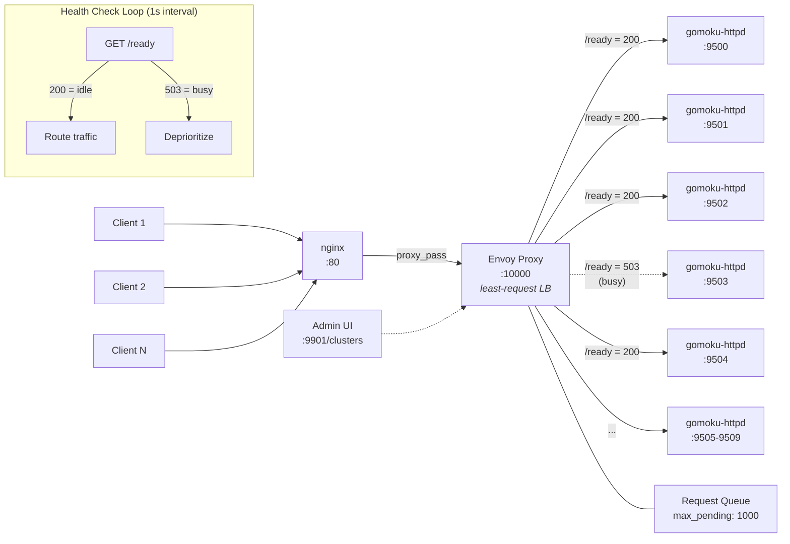

# Gomoku HTTP Daemon

A stateless HTTP server that provides a REST API for playing Gomoku games. The daemon accepts game state via JSON, makes an AI move, and returns the updated state.

> [!CAUTION]
> This documentation is slightly behind the actual source code. We have since added the [`iac`](../iac) folder, with haproxy config, K8S setup, and deployment, and more.

## Table of Contents

- [Gomoku HTTP Daemon](#gomoku-http-daemon)
  - [Table of Contents](#table-of-contents)
  - [Building](#building)
  - [HTTP Daemon](#http-daemon)
    - [Usage](#usage)
    - [CLI Options](#cli-options)
    - [Daemon Examples](#daemon-examples)
  - [HTTP API](#http-api)
    - [POST /gomoku/play](#post-gomokuplay)
    - [GET /health](#get-health)
    - [Error Responses](#error-responses)
  - [JSON Game Format](#json-game-format)
    - [Field Descriptions](#field-descriptions)
    - [Move Format](#move-format)
  - [Testing with curl](#testing-with-curl)
    - [Start a New Game](#start-a-new-game)
    - [Continue a Game](#continue-a-game)
    - [Health Check](#health-check)
    - [Test Different AI Depths](#test-different-ai-depths)
  - [Test Client](#test-client)
    - [Test Client Usage](#test-client-usage)
    - [Test Client Options](#test-client-options)
    - [Test Client Examples](#test-client-examples)
    - [Sample Output](#sample-output)
  - [Logging](#logging)
    - [Log Format](#log-format)
    - [Log Levels](#log-levels)
    - [Signal Handling](#signal-handling)
  - [Architecture](#architecture)
  - [Stateful vs Stateless](#stateful-vs-stateless)

---

## Building

Build both the daemon and test client:

```bash
make all                    # Build gomoku and gomoku-httpd
make gomoku-httpd           # Build only the HTTP daemon
make test-client            # Build the test client (gomoku-http-client)
```

Clean build artifacts:

```bash
make clean
```

---

## HTTP Daemon

### Usage — Single Daemon

```
gomoku-httpd -b <host:port> [options]
```

The daemon runs as a foreground process by default. Use `-d` to daemonize.

### CLI Options

| Flag | Long Form | Description | Default |
|------|-----------|-------------|---------|
| `-b` | `--bind` | Host and port to bind (required) | - |
| `-a` | `--agent-port` | HAProxy agent-check port | disabled |
| `-d` | `--daemonize` | Run as background daemon | No |
| `-l` | `--log-file` | Path to log file | stdout |
| `-L` | `--log-level` | Log level: TRACE, DEBUG, INFO, WARN, ERROR, FATAL | INFO |
| `-h` | `--help` | Show help message | - |

### Daemon Examples

Start daemon on localhost port 3000:

```bash
./gomoku-httpd -b 127.0.0.1:3000
```

Start daemon on all interfaces with debug logging:

```bash
./gomoku-httpd -b 0.0.0.0:8080 -L DEBUG
```

Run as background daemon with log file:

```bash
./gomoku-httpd -d -b 0.0.0.0:3000 -l /var/log/gomoku.log
```

Stop the daemon:

```bash
pkill gomoku-httpd
# or send SIGTERM
kill $(pgrep gomoku-httpd)
```

## Running a Cluster with HAProxy

You can deploy HAProxy in front of multiple `gomoku-httpd` instances for load balancing:


Below you see multple clients connecting to HAProxy same port, which then distributes requests to a cluster of `gomoku-httpd` daemons. Whenever a daemon is busy computing a move, it responds to haproxy with the status `drain` which makes haproxy avoid sending new requests to that busy daemon.


HAProxy comes with a built-in web dashboard which is very easy to read. You can observe the connection pool and its status in real time.


> [!TIP]
> If you use `iac/config/haproxy.cfg` configuration file, you can run a cluster of 10 gomoku-httpd instances with a single HAProxy process locally and test it with `./gomoku-http-client -p 10000`. 
> 
> To start the cluster, run `make install`, then `gomokud-ctl start`. Use brew to install `haproxy` on macOS, start it as a service via `brew services start haproxy`. Then go to `/opt/homebrew/etc` folder and create a symlink to `iac/config/haproxy.cfg` file in this repo. After that restart the haproxy service via `brew services restart haproxy`. Note that `gomoku-ctl start` starts gomoku-httpd services listening on ports 9500, 9501, ... while the agent status check ports are 9600, 9601, ...
> 
> You should be able to monitor haproxy connection pool via [http://localhost:8404/stats](http://localhost:8404/stats) (no password for localhost access).


### Agent-Check for HAProxy

For load-balanced deployments, the daemon can run an agent-check server that reports whether the server is idle or busy:

```bash
# Start with agent-check on port 8788
./gomoku-httpd -b 0.0.0.0:8787 -a 8788
```

The agent-check port responds with:
- `ready` - Server is idle, can accept new requests
- `drain` - Server is busy computing a move

This allows HAProxy to make intelligent routing decisions based on actual server availability, routing requests only to idle servers rather than just checking if the process is running.

Test manually with:

```bash
nc localhost 8788
# Returns: ready (or drain if busy)
```

See [iac/README.md](../iac/README.md) for Kubernetes deployment with HAProxy integration.

### HAProxy With the Cluster of `gomoku-httpd` daemons

The following diagram depects the idea:


## Running a Cluster with Envoy

As an alternative to HAProxy, you can deploy [Envoy Proxy](https://www.envoyproxy.io/) in front of the `gomoku-httpd` cluster. Envoy offers built-in request queueing via circuit breakers, HTTP-based health checks, and automatic retries with exponential backoff -- features that allow it to handle burst traffic more gracefully than HAProxy's agent-check model.

### Envoy Routing Architecture

The following diagram shows how Envoy routes game requests from clients through nginx to the cluster of `gomoku-httpd` daemons:



### How Envoy Differs from HAProxy

| Feature | HAProxy | Envoy |
|---------|---------|-------|
| Health Check | TCP agent-check (`drain`/`ready`) | HTTP `GET /ready` (200 vs 503) |
| Request Queue | Limited (via `maxconn`) | Circuit breaker (`max_pending_requests: 1000`) |
| Retry Policy | Manual configuration | Built-in with exponential backoff |
| Load Balancing | Round-robin with drain awareness | Least-request with health-check awareness |
| Admin Interface | Stats page on `:8404` | Full REST API on `:9901` |

### Key Envoy Features

- **Request Queueing**: When all servers are busy, Envoy queues up to 1000 pending requests via its circuit breaker. Requests are dispatched as servers become available, preventing 503 errors during bursts.
- **Least-Request Load Balancing**: Routes each new request to the endpoint with the fewest active connections, naturally preferring idle servers.
- **Automatic Retries**: On 503 responses, Envoy retries up to 3 times with exponential backoff (100ms to 10s), giving busy servers time to finish.
- **HTTP Health Checks**: Polls each server's `/ready` endpoint every second. Servers responding with 503 (busy) are deprioritized but not ejected, allowing requests to queue rather than fail.

### Starting the Cluster with Envoy

```bash
# Start the full stack (nginx + envoy + gomoku daemons)
bin/gomoku-cluster start --proxy envoy

# Or start components individually
bin/gomoku-cluster start -c nginx -c envoy -c gomoku
```

The Envoy admin interface is available at [http://127.0.0.1:9901](http://127.0.0.1:9901). See [`iac/envoy/README.md`](../iac/envoy/README.md) for detailed configuration documentation.

---

## HTTP API

### POST /gomoku/play

Make an AI move in a Gomoku game.

**Request:**

- Method: `POST`
- Content-Type: `application/json`
- Body: JSON game state (see [JSON Game Format](#json-game-format))

**Response:**

- Content-Type: `application/json`
- Body: Updated JSON game state with AI's move appended

**Behavior:**

1. Parses the JSON game state
2. Caps AI depth to 6 and radius to 4 (for performance)
3. If game already has a winner, returns unchanged
4. Determines which player AI should be (opposite of last move)
5. Computes best move using minimax with alpha-beta pruning
6. Appends move to history and updates board state
7. Checks for winner after move
8. Returns updated game state

### GET /health

Health check endpoint.

**Request:**

- Method: `GET`

**Response:**

```json
{
  "status": "ok",
  "version": "1.0.0",
  "uptime": "2h 15m 30s"
}
```

### Error Responses

| Status | Description |
|--------|-------------|
| 400 | Bad Request - Invalid JSON or missing required fields |
| 404 | Not Found - Unknown endpoint |
| 405 | Method Not Allowed - Wrong HTTP method |
| 500 | Internal Server Error - AI failed to compute move |

Error response format:

```json
{
  "error": "Error message describing the problem"
}
```

---

## JSON Game Format

The game state JSON format:

```json
{
  "X": {
    "player": "human",
    "time_ms": 0.0
  },
  "O": {
    "player": "AI",
    "depth": 2,
    "time_ms": 1.234
  },
  "board_size": 15,
  "radius": 2,
  "timeout": "none",
  "winner": "none",
  "board_state": [
    ". . . . . . . . . . . . . . .",
    ". . . . . . . . . . . . . . .",
    "..."
  ],
  "moves": [
    {
      "X (human)": [7, 7],
      "time_ms": 0.0
    },
    {
      "O (AI)": [8, 8],
      "time_ms": 0.456
    }
  ]
}
```

### Field Descriptions

| Field | Type | Description |
|-------|------|-------------|
| `X` | object | Player X configuration |
| `X.player` | string | "human" or "AI" |
| `X.depth` | int | AI search depth (1-6, only if AI) |
| `X.time_ms` | float | Total time spent by this player |
| `O` | object | Player O configuration (same structure as X) |
| `board` | int | Board size: 15 or 19 |
| `radius` | int | AI search radius (1-4) |
| `timeout` | string | Move timeout: "none" or seconds |
| `winner` | string | "none", "X", "O", or "draw" |
| `board_state` | array | Visual board representation (optional, regenerated) |
| `moves` | array | Move history |

### Move Format

Each move in the `moves` array:

```json
{
  "X (human)": [x, y],
  "time_ms": 0.123
}
```

Or for AI moves:

```json
{
  "O (AI)": [x, y],
  "time_ms": 0.456
}
```

Coordinates are 0-indexed from the top-left corner.

---

## Testing with curl

### Start a New Game

Create a game where human plays X and AI plays O:

```bash
curl -X POST http://127.0.0.1:3000/gomoku/play \
  -H "Content-Type: application/json" \
  -d '{
    "X": {"player": "human", "time_ms": 0},
    "O": {"player": "AI", "depth": 2, "time_ms": 0},
    "board_size": 15,
    "radius": 2,
    "timeout": "none",
    "winner": "none",
    "board_state": [],
    "moves": [{"X (human)": [7, 7], "time_ms": 0}]
  }'
```

### Continue a Game

Take the response from the previous call, add your move to the `moves` array, and send it back:

```bash
# Save response to file
curl -X POST http://127.0.0.1:3000/gomoku/play \
  -H "Content-Type: application/json" \
  -d @game_state.json > updated_state.json
```

### Health Check

```bash
curl http://127.0.0.1:3000/health
```

Output:

```json
{"status":"ok","version":"1.0.0","uptime":"5m 30s"}
```

### Test Different AI Depths

Depth 1 (fastest, weakest):

```bash
curl -X POST http://127.0.0.1:3000/gomoku/play \
  -H "Content-Type: application/json" \
  -d '{"X":{"player":"human"},"O":{"player":"AI","depth":1},"board_size":15,"radius":2,"timeout":"none","winner":"none","board_state":[],"moves":[{"X (human)":[7,7],"time_ms":0}]}'
```

Depth 4 (slowest, strongest):

```bash
curl -X POST http://127.0.0.1:3000/gomoku/play \
  -H "Content-Type: application/json" \
  -d '{"X":{"player":"human"},"O":{"player":"AI","depth":4},"board_size":15,"radius":3,"timeout":"none","winner":"none","board_state":[],"moves":[{"X (human)":[7,7],"time_ms":0}]}'
```

---

## Test Client

An automated test client that plays complete games against the HTTP daemon.

### Test Client Usage

```
gomoku-http-client [options]
```

The client plays as X (human) using a simple spiral strategy while the server's AI plays as O.

### Test Client Options

| Flag | Long Form | Description | Default |
|------|-----------|-------------|---------|
| `-h` | `--host` | Server host | 127.0.0.1 |
| `-p` | `--port` | Server port | 9900 |
| `-d` | `--depth` | AI search depth (1-6) | 2 |
| `-r` | `--radius` | AI search radius (1-4) | 2 |
| `-b` | `--board` | Board size (15 or 19) | 15 |
| `-j` | `--json` | Save final game to JSON file | - |
| `-v` | `--verbose` | Show full game state after each move | No |
| | `--help` | Show help message | - |

### Test Client Examples

Play a game with default settings (connects to 127.0.0.1:9900):

```bash
./gomoku-http-client
```

Connect to a server on a different port:

```bash
./gomoku-http-client -p 3000
```

Play with stronger AI (depth 4):

```bash
./gomoku-http-client -d 4 -r 3
```

Play on 19x19 board and save result:

```bash
./gomoku-http-client -b 19 -j game_result.json
```

Play with verbose output to see full game state:

```bash
./gomoku-http-client -v
```

### Sample Output

```text
Connecting to gomoku-http-daemon at 127.0.0.1:9900
Playing as X (human) against O (AI depth=2, radius=2, board=15)

Move 1: X plays [7, 7]
Move 2: O plays [8, 8]
Move 3: X plays [6, 6]
Move 4: O plays [6, 8]
Move 5: X plays [6, 7]
Move 6: O plays [5, 6]
...
Move 29: X plays [3, 10]
Move 30: O plays [12, 8]
Move 31: X plays [2, 11]

Final board:
. . . . . . . . . . . . . . .
. . . . . . . . . . . . . . .
. . . . . . . . . . . X . . .
. . . . . . . . . . X . . . .
. . . . . O . . . X . . . . .
. . . . . . O . X . . . . . .
. . . . . . X X O O . . . . .
. . . . . . X X X O . . . . .
. . . . . . X X O O . O . . .
. . . . . . X . O . . . . . .
. . . . . . X . O . . . . . .
. . . . . . . . O . . . . . .
. . . . . . . . O . . . . . .
. . . . . . . . . . . . . . .
. . . . . . . . . . . . . . .

Game over: O (AI) wins!
Total moves: 31
Game saved to: game_result.json
```

---

## Logging

The daemon logs each HTTP request at INFO level with:

- **Client IP**: Source IP address
- **Path**: Request path
- **Status Code**: HTTP response status
- **Response Time**: Processing time in milliseconds

### Log Format

```
2026-01-29 18:47:51 INFO  src/net/handlers.c:80: 127.0.0.1 /gomoku/play 200 0.792ms
2026-01-29 18:47:51 INFO  src/net/handlers.c:80: 127.0.0.1 /health 200 0.037ms
```

### Log Levels

| Level | Description |
|-------|-------------|
| TRACE | Very detailed debugging information |
| DEBUG | Debugging information (request details, AI decisions) |
| INFO | Normal operation (request logs, game outcomes) |
| WARN | Warnings (invalid requests, capped parameters) |
| ERROR | Errors (failed operations) |
| FATAL | Fatal errors (startup failures) |

### Signal Handling

| Signal | Action |
|--------|--------|
| SIGTERM | Graceful shutdown |
| SIGINT | Graceful shutdown (Ctrl+C) |
| SIGHUP | Log file reopen (for log rotation) |
| SIGPIPE | Ignored (prevents crash on broken connections) |

---

## Architecture


<details>
<summary>Click to see Mermaid Source (or auto-rendering):</summary>


</details>

## Stateful vs Stateless

The Gomoku daemon is completely stateless. All of the game state is passed in each request and returned in each response with one extra move made. This allows:

- Horizontal scaling (multiple daemon instances)
- Client-side game persistence
- Easy debugging (full state in each request)
- No session management required
