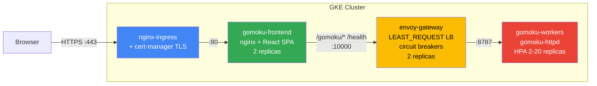

# Production Deployment Guide

This project supports two production deployment targets on Google Cloud Platform. Choose the one that fits your needs.

| | Cloud Run | GKE (Kubernetes) |
|---|---|---|
| **Complexity** | Low — serverless, no cluster to manage | High — full K8s cluster, Envoy, cert-manager |
| **Cost at idle** | $0 (scales to zero) | ~$140/mo (2 x e2-standard-4 nodes always on) |
| **Cost under load** | Pay-per-request + CPU time | Fixed node cost, autoscales pods within nodes |
| **Cold start** | 1-2s on first request after idle | None (pods always running) |
| **Config location** | `iac/cloud_run/` | `iac/k8s/` + `bin/gcp-create-cluster` |
| **Deploy command** | `cd iac/cloud_run && ./deploy.sh` | `bin/gcp-create-cluster setup && bin/gcp-create-cluster deploy` |
| **Custom domain SSL** | Google-managed (automatic) | cert-manager + Let's Encrypt |
| **Load balancing** | Cloud Run built-in | Envoy gateway (LEAST_REQUEST, circuit breakers) |

---

## Option 1: Cloud Run (Recommended)

Simpler, cheaper at low traffic, zero maintenance. Full documentation is in [`iac/cloud_run/README.md`](../iac/cloud_run/README.md).

### Architecture

Very simple:


### Quick Deploy

```bash
export PROJECT_ID="fine-booking-486503-k7"
cd iac/cloud_run
./deploy.sh
```

### Service URLs

| Service  | URL |
|----------|-----|
| Frontend | https://gomoku-frontend-hdnatxbb3a-wl.a.run.app |
| Backend  | https://gomoku-httpd-hdnatxbb3a-wl.a.run.app |

### Update Individual Components

```bash
REGION="us-central1"

# Frontend only
IMAGE="$REGION-docker.pkg.dev/$PROJECT_ID/gomoku-repo/gomoku-frontend:latest"
docker buildx build --platform linux/amd64 -t "$IMAGE" --load frontend/
docker push "$IMAGE"
gcloud run services update gomoku-frontend --region=$REGION --image=$IMAGE

# Backend only
IMAGE="$REGION-docker.pkg.dev/$PROJECT_ID/gomoku-repo/gomoku-httpd:latest"
docker buildx build --platform linux/amd64 -t "$IMAGE" --load .
docker push "$IMAGE"
gcloud run services update gomoku-httpd --region=$REGION --image=$IMAGE
```

### Custom Domain (gomoku.games)

Cloud Run uses Google-managed SSL certificates with HTTP-01 validation. No certbot or DNS provider API credentials needed — just add DNS records and Google handles the rest.

```bash
# 1. Verify domain ownership (adds a TXT record)
gcloud domains verify gomoku.games

# 2. Create domain mapping
gcloud run domain-mappings create \
    --service=gomoku-frontend \
    --domain=gomoku.games \
    --region=us-central1

# 3. Add DNS records in DnsMadeEasy (A records for apex domain):
#    @ → 216.239.32.21, 216.239.34.21, 216.239.36.21, 216.239.38.21
#
#    Or for a subdomain (app.gomoku.games), just one CNAME:
#    app → ghs.googlehosted.com.

# 4. Check SSL provisioning status
gcloud run domain-mappings describe --domain=gomoku.games --region=us-central1
```

### Monitoring

```bash
# Live logs
gcloud run services logs tail gomoku-httpd --region=us-central1
gcloud run services logs tail gomoku-frontend --region=us-central1

# Health checks
curl https://gomoku-frontend-hdnatxbb3a-wl.a.run.app/nginx-health
curl https://gomoku-frontend-hdnatxbb3a-wl.a.run.app/health
```

Cloud Console dashboards:
- [Cloud Run overview](https://console.cloud.google.com/run?project=fine-booking-486503-k7)
- [Frontend metrics](https://console.cloud.google.com/run/detail/us-central1/gomoku-frontend/metrics?project=fine-booking-486503-k7)
- [Backend metrics](https://console.cloud.google.com/run/detail/us-central1/gomoku-httpd/metrics?project=fine-booking-486503-k7)

### Terraform State

Stored remotely in GCS for team collaboration:

```
gs://gomoku-tfstate-fine-booking/cloud-run/gomoku/
```

Any collaborator with GCP project access can run `terraform init` to connect.

---

## Option 2: GKE (Kubernetes)

Full Kubernetes deployment with Envoy gateway for advanced load balancing. More complex to set up and operate, but gives fine-grained control over networking, circuit breaking, and pod-level scaling.

### Architecture



### Prerequisites

```bash
export PROJECT_ID="fine-booking-486503-k7"
export REGION="us-central1"
export CLUSTER_NAME="gomoku-cluster"
```

Ensure these are set in your `.envrc` / `.env` file (the script reads them from there).

### Setup (One-Time)

Creates the GKE cluster, Cloud NAT, Artifact Registry, builds and pushes images:

```bash
bin/gcp-create-cluster setup
```

This will:
1. Create a private GKE zonal cluster (2 x e2-standard-4 nodes)
2. Set up Cloud NAT for outbound internet from private nodes
3. Create Artifact Registry repository
4. Build both Docker images for linux/amd64
5. Push images to Artifact Registry

### Deploy

Installs nginx-ingress, cert-manager, and deploys all K8s resources:

```bash
bin/gcp-create-cluster deploy
```

This will:
1. Install nginx-ingress controller and wait for external IP
2. Prompt you to update DNS for `gomoku.games` to the external IP
3. Install cert-manager with Let's Encrypt ClusterIssuer
4. Update image references in kustomization.yaml
5. Apply all K8s manifests via `kubectl apply -k iac/k8s/`

### Custom Domain (gomoku.games)

GKE uses cert-manager with Let's Encrypt HTTP-01 challenges via the nginx-ingress controller.

1. The `deploy` command prints the ingress external IP
2. Point `gomoku.games` A record to that IP in DnsMadeEasy
3. cert-manager automatically requests and renews the TLS certificate

### Monitoring

```bash
# Pod status
kubectl get pods -n gomoku

# Resource usage
kubectl top pods -n gomoku

# Worker logs
kubectl logs -n gomoku -l app.kubernetes.io/component=worker --tail=100

# Envoy admin dashboard
kubectl port-forward -n gomoku svc/envoy-gateway 9901:9901
# Then visit http://localhost:9901

# HPA status (worker autoscaling)
kubectl get hpa -n gomoku
```

### Scaling

```bash
# Manual scaling
kubectl scale deployment gomoku-workers -n gomoku --replicas=8

# HPA automatically scales workers between 2-20 based on CPU
kubectl describe hpa gomoku-workers -n gomoku
```

### Updating

```bash
REGISTRY="${REGION}-docker.pkg.dev/${PROJECT_ID}/gomoku"

# Build and push new images
docker buildx build --platform linux/amd64 -t ${REGISTRY}/gomoku-httpd:latest --load .
docker buildx build --platform linux/amd64 -t ${REGISTRY}/gomoku-frontend:latest --load frontend/
docker push ${REGISTRY}/gomoku-httpd:latest
docker push ${REGISTRY}/gomoku-frontend:latest

# Rolling update (triggers new pods)
kubectl rollout restart deployment gomoku-workers -n gomoku
kubectl rollout restart deployment gomoku-frontend -n gomoku
```

### Teardown

```bash
# Delete K8s resources
kubectl delete -k iac/k8s/

# Delete the cluster entirely
gcloud container clusters delete $CLUSTER_NAME --zone ${REGION}-a
```

---

## Troubleshooting

### Cloud Run

| Problem | Fix |
|---------|-----|
| 405 on POST | Check `VITE_API_BASE` in frontend `.env` — must be empty for production |
| CPU < 1 with concurrency > 1 | Cloud Run requires CPU >= 1000m when concurrency > 1 |
| Memory < 512Mi | CPU always-allocated requires memory >= 512Mi |
| Image not updating | Use `gcloud run services update` to force a new revision with `:latest` |
| ARM64 image on Cloud Run | Always build with `--platform linux/amd64` |

### GKE

| Problem | Fix |
|---------|-----|
| Pods stuck in ImagePullBackOff | Private nodes need Cloud NAT; check `gomoku-nat` exists |
| Certificate not issuing | Check `kubectl describe certificate -n gomoku` and cert-manager logs |
| 503 under load | Check HPA: `kubectl get hpa -n gomoku`; increase `maxReplicas` |
| Envoy not discovering workers | Verify headless service: `kubectl run debug --image=busybox -n gomoku -- nslookup gomoku-workers` |
