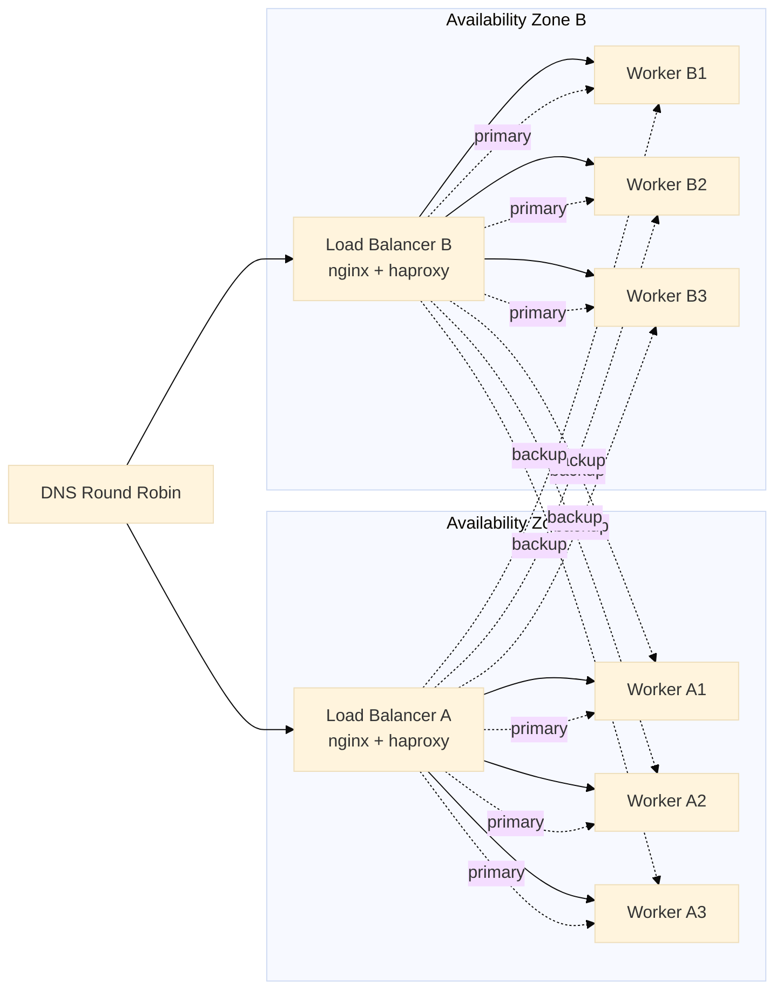

# Infrastructure as Code for Gomoku AI Platform

This directory contains configuration files and Kubernetes manifests for deploying the Gomoku AI backend as a highly available, scalable service across multiple availability zones.

## Architecture Overview



### Key Design Principles

1. **Zone Affinity**: Each load balancer routes primarily to workers in its own AZ to minimize latency and cross-AZ data transfer costs.

2. **Automatic Overflow**: When the primary zone is overloaded, traffic automatically overflows to the backup zone.

3. **HAProxy Agent-Check**: The `gomoku-httpd` daemon exposes a separate TCP port (8788) that responds with `ready` or `drain` based on whether it's currently processing a request. This enables intelligent routing to idle servers.

4. **Single-Threaded Optimization**: Each worker pod is allocated exactly 1 CPU core, matching the single-threaded nature of the minimax AI algorithm.

## Directory Structure

```
iac/
├── README.md                     # This file
├── config/                       # Raw configuration files for nginx and haproxy
│   ├── nginx.conf                # nginx config for SSL termination and routing
│   ├── haproxy-az-a.cfg          # HAProxy config for AZ-a (primary: zone-a workers)
│   └── haproxy-az-b.cfg          # HAProxy config for AZ-b (primary: zone-b workers)
├── k8s/                          # Kubernetes manifests
│   ├── kustomization.yaml        # Kustomize configuration
│   ├── namespace.yaml            # Namespace definition
│   ├── configmaps.yaml           # ConfigMaps for nginx/haproxy
│   ├── gomoku-workers-az-a.yaml  # Worker deployment for AZ-a
│   ├── gomoku-workers-az-b.yaml  # Worker deployment for AZ-b
│   ├── loadbalancer-az-a.yaml    # Load balancer for AZ-a
│   └── loadbalancer-az-b.yaml    # Load balancer for AZ-b
└── (legacy files)
    ├── gomoku-deployment.yaml    # Legacy single-zone deployment
    ├── gomoku-service.yaml       # Legacy service
    └── haproxy.yaml              # Legacy HAProxy config
```

## Deployment Instructions

### Prerequisites

- A Kubernetes cluster with nodes in at least two availability zones
- `kubectl` configured to connect to your cluster
- Docker image `gomoku-httpd:latest` available in your registry

### Quick Start with Kustomize

```bash
# Deploy all resources
kubectl apply -k iac/k8s/

# Verify deployment
kubectl get all -n gomoku

# Check worker pods
kubectl get pods -n gomoku -l app.kubernetes.io/component=worker

# Check load balancer services
kubectl get svc -n gomoku -l app.kubernetes.io/component=loadbalancer
```

### Customizing the Deployment

1. **Change replica count**: Edit `spec.replicas` in `gomoku-workers-az-*.yaml`

2. **Change image**: Update `kustomization.yaml`:

   ```yaml
   images:
     - name: gomoku-httpd
       newName: your-registry/gomoku-httpd
       newTag: v1.0.0
   ```

3. **Add TLS certificates**: Create a secret:

   ```bash
   kubectl create secret tls gomoku-tls-cert \
     --cert=path/to/cert.pem \
     --key=path/to/key.pem \
     -n gomoku
   ```

### Manual Deployment (without Kustomize)

```bash
cd iac/k8s/
kubectl apply -f namespace.yaml
kubectl apply -f configmaps.yaml
kubectl apply -f gomoku-workers-az-a.yaml
kubectl apply -f gomoku-workers-az-b.yaml
kubectl apply -f loadbalancer-az-a.yaml
kubectl apply -f loadbalancer-az-b.yaml
```

## Non-Kubernetes Deployment

For bare-metal or VM-based deployments:

### Load Balancer Box Setup (per AZ)

1. **Install nginx and haproxy**:

   ```bash
   apt-get install nginx haproxy
   ```

2. **Copy configuration**:

   ```bash
   # For AZ-a load balancer:
   cp iac/config/nginx.conf /etc/nginx/nginx.conf
   cp iac/config/haproxy-az-a.cfg /etc/haproxy/haproxy.cfg

   # For AZ-b load balancer:
   cp iac/config/nginx.conf /etc/nginx/nginx.conf
   cp iac/config/haproxy-az-b.cfg /etc/haproxy/haproxy.cfg
   ```

3. **Edit IP addresses** in haproxy config to match your worker IPs

4. **Start services**:

   ```bash
   systemctl restart nginx
   systemctl restart haproxy
   ```

### Worker Setup

1. **Run gomoku-httpd with agent-check**:

   ```bash
   ./gomoku-httpd -b 0.0.0.0:8787 -a 8788 -d -l /var/log/gomoku.log
   ```

   Or with Docker:

   ```bash
   docker run -d -p 8787:8787 -p 8788:8788 gomoku-httpd:latest
   ```

## HAProxy Agent-Check Protocol

The `gomoku-httpd` daemon implements HAProxy's agent-check protocol on port 8788:

| Response | Meaning |
|----------|---------|
| `ready`  | Server is idle, can accept new requests |
| `drain`  | Server is busy computing a move, don't send new requests |

This allows HAProxy to make intelligent routing decisions based on actual server availability, not just whether the process is running.

### Testing Agent-Check Manually

```bash
# Connect to agent port
nc localhost 8788
# Server responds with "ready" or "drain"
```

## Monitoring

### HAProxy Statistics

Access HAProxy stats at `http://localhost:8404/stats` on each load balancer.

### Useful kubectl Commands

```bash
# Watch pod status
kubectl get pods -n gomoku -w

# Check logs
kubectl logs -n gomoku -l app.kubernetes.io/component=worker --tail=100

# Get worker endpoints
kubectl get endpoints -n gomoku gomoku-workers-az-a

# Scale workers
kubectl scale deployment gomoku-workers-az-a -n gomoku --replicas=10
```

## Cleanup

```bash
# Delete all resources
kubectl delete -k iac/k8s/

# Or delete namespace (removes everything)
kubectl delete namespace gomoku
```

## Interacting with the Service

```bash
# Health check
curl http://<LOAD_BALANCER_IP>/health

# Start a new game (X plays first at center)
curl -X POST http://<LOAD_BALANCER_IP>/gomoku/play \
  -H "Content-Type: application/json" \
  -d '{
    "X": { "player": "AI", "depth": 4 },
    "O": { "player": "AI", "depth": 4 },
    "board_size": 15,
    "radius": 2,
    "timeout": "none",
    "winner": "none",
    "board_state": [],
    "moves": []
  }'
```

See [doc/HTTPD.md](../doc/HTTPD.md) for complete API documentation and JSON format reference.
