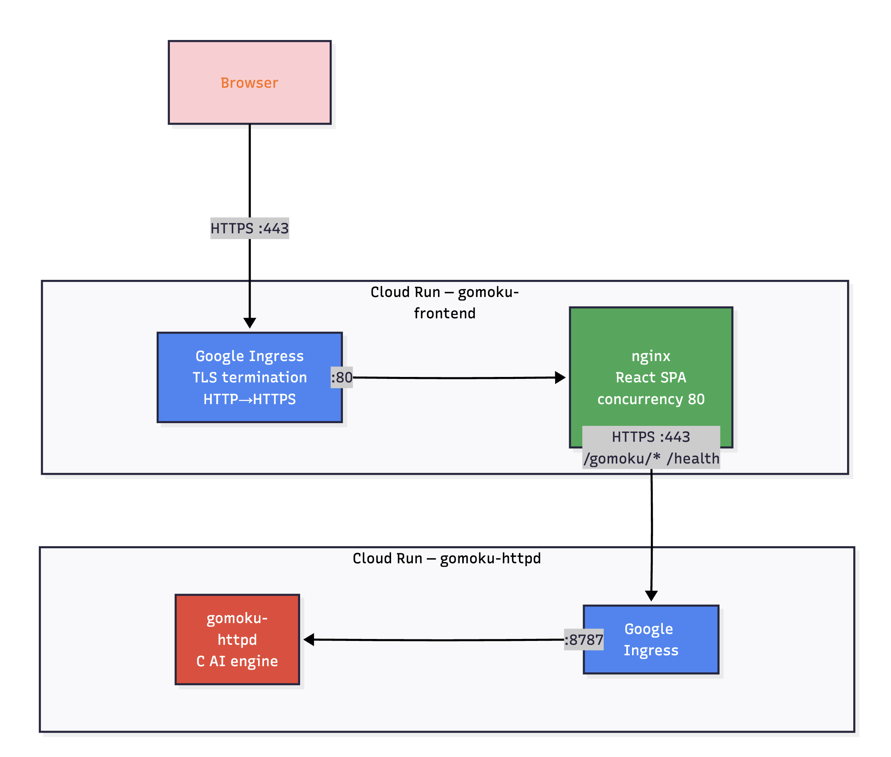
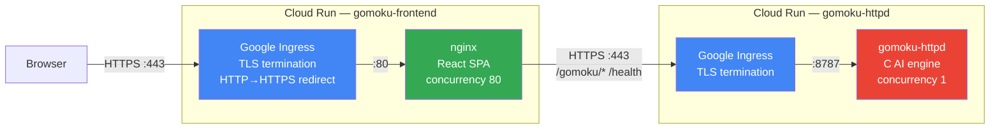
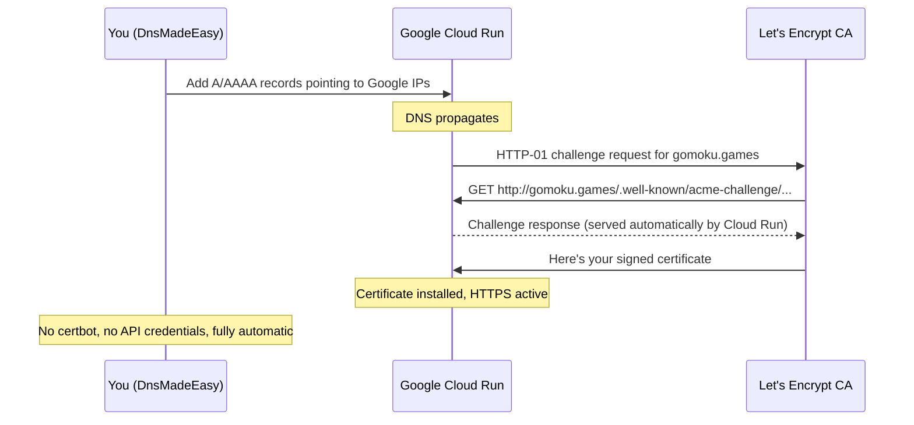

# Gomoku on Google Cloud Run

This directory contains Terraform configuration to deploy both the **backend** (`gomoku-httpd`) and **frontend** (nginx + React SPA) to Google Cloud Run.

## Architecture

Below is the diagram of how the application is deployed to Google.



<details>
<summary>Click to expand Mermaid Github's Rendering</summary>


</details>

**TLS handling**: Cloud Run's ingress layer terminates TLS and automatically redirects HTTP to HTTPS. The containers themselves listen on plain HTTP internally. Browsers always connect over HTTPS on port 443.

- **Frontend**: nginx serves the React SPA and reverse-proxies `/gomoku/` and `/health` to the backend over HTTPS.
- **Backend**: Single-threaded C binary. Concurrency is set to 1, so Cloud Run auto-scales a new instance for every concurrent request.
- **Images**: Stored in Artifact Registry at `us-central1-docker.pkg.dev/<PROJECT>/gomoku-repo/`.

## Prerequisites

1. [Google Cloud SDK](https://cloud.google.com/sdk/docs/install) (`gcloud` CLI)
2. [Terraform](https://www.terraform.io/) >= 1.0
3. [Docker Desktop](https://www.docker.com/products/docker-desktop/) with `buildx` support
4. A Google Cloud Project with billing enabled

## Quick Start: Full Deploy

```bash
export PROJECT_ID="fine-booking-486503-k7"
cd iac/cloud_run
./deploy.sh
```

This single script will:
1. Initialize Terraform and create the Artifact Registry
2. Build **both** Docker images (linux/amd64) locally
3. Push them to Artifact Registry
4. Deploy both Cloud Run services via Terraform
5. Print the backend and frontend URLs

## Deploying Individual Components

### Update Frontend Only

When you've changed the React app or nginx config:

```bash
export PROJECT_ID="fine-booking-486503-k7"
REGION="us-central1"
IMAGE="$REGION-docker.pkg.dev/$PROJECT_ID/gomoku-repo/gomoku-frontend:latest"

# Build and push
docker buildx build --platform linux/amd64 -t "$IMAGE" --load ../../frontend/
docker push "$IMAGE"

# Deploy new revision
gcloud run services update gomoku-frontend --region=$REGION --image=$IMAGE
```

### Update Backend Only

When you've changed the C source code:

```bash
export PROJECT_ID="fine-booking-486503-k7"
REGION="us-central1"
IMAGE="$REGION-docker.pkg.dev/$PROJECT_ID/gomoku-repo/gomoku-httpd:latest"

# Build and push (from project root context)
docker buildx build --platform linux/amd64 -t "$IMAGE" --load ../../
docker push "$IMAGE"

# Deploy new revision
gcloud run services update gomoku-httpd --region=$REGION --image=$IMAGE
```

### Apply Terraform Changes Only

When you've changed `main.tf`, `variables.tf`, etc. (no image rebuild needed):

```bash
BACKEND_IMAGE="us-central1-docker.pkg.dev/$PROJECT_ID/gomoku-repo/gomoku-httpd:latest"
FRONTEND_IMAGE="us-central1-docker.pkg.dev/$PROJECT_ID/gomoku-repo/gomoku-frontend:latest"

terraform apply \
    -var="project_id=$PROJECT_ID" \
    -var="region=us-central1" \
    -var="container_image=$BACKEND_IMAGE" \
    -var="frontend_image=$FRONTEND_IMAGE"
```

## Monitoring & Observability

### Service URLs

| Service  | URL |
|----------|-----|
| Frontend | https://gomoku-frontend-hdnatxbb3a-wl.a.run.app |
| Backend  | https://gomoku-httpd-hdnatxbb3a-wl.a.run.app |

### Quick Health Checks

```bash
# Frontend nginx health
curl https://gomoku-frontend-hdnatxbb3a-wl.a.run.app/nginx-health

# Backend health (proxied through frontend)
curl https://gomoku-frontend-hdnatxbb3a-wl.a.run.app/health

# Backend health (direct)
curl https://gomoku-httpd-hdnatxbb3a-wl.a.run.app/health
```

### Cloud Console Dashboards

- **Cloud Run overview**: https://console.cloud.google.com/run?project=fine-booking-486503-k7
- **Frontend metrics**: https://console.cloud.google.com/run/detail/us-central1/gomoku-frontend/metrics?project=fine-booking-486503-k7
- **Backend metrics**: https://console.cloud.google.com/run/detail/us-central1/gomoku-httpd/metrics?project=fine-booking-486503-k7
- **Logs**: https://console.cloud.google.com/logs?project=fine-booking-486503-k7

### CLI Commands

```bash
# List running revisions and traffic split
gcloud run revisions list --service=gomoku-httpd --region=us-central1
gcloud run revisions list --service=gomoku-frontend --region=us-central1

# View recent logs (live tail)
gcloud run services logs tail gomoku-httpd --region=us-central1
gcloud run services logs tail gomoku-frontend --region=us-central1

# Read last 50 log entries
gcloud run services logs read gomoku-httpd --region=us-central1 --limit=50
gcloud run services logs read gomoku-frontend --region=us-central1 --limit=50

# Check current instance count and request metrics
gcloud run services describe gomoku-httpd --region=us-central1 --format="yaml(status)"
gcloud run services describe gomoku-frontend --region=us-central1 --format="yaml(status)"
```

### Key Metrics to Watch

In the Cloud Console metrics dashboard, the most useful graphs are:

- **Request count** — total requests per second
- **Request latency** — p50/p95/p99 response times (AI moves can take seconds at higher depths)
- **Instance count** — how many containers are running (backend scales 1:1 with concurrent requests)
- **Container CPU/Memory utilization** — watch for OOM or CPU throttling
- **Billable instance time** — cost tracking

## Scaling Configuration

| Setting | Backend | Frontend |
|---------|---------|----------|
| Min instances | 0 | 0 |
| Max instances | 20 | 3 |
| Concurrency | 1 | 80 |
| CPU | 1 vCPU | 1 vCPU |
| Memory | 512 Mi | 512 Mi |

The backend uses concurrency=1 because `gomoku-httpd` is single-threaded. Cloud Run spins up a new instance for each concurrent request. The frontend nginx can handle many concurrent connections.

To adjust scaling:

```bash
# Increase backend max instances for higher concurrent load
gcloud run services update gomoku-httpd --region=us-central1 --max-instances=50

# Keep a warm instance to avoid cold starts
gcloud run services update gomoku-httpd --region=us-central1 --min-instances=1
```

## Custom Domain: gomoku.games

To serve the frontend under `https://gomoku.games`, use Cloud Run domain mapping. Google provisions the SSL certificate automatically — **you do not need certbot, Let's Encrypt CLI, or DnsMadeEasy API credentials.** Google uses HTTP-01 validation: once DNS points to Google's servers, Cloud Run itself responds to the ACME challenge internally. No DNS-01 challenge is involved.

All you need to do in DnsMadeEasy is add a few static DNS records.

### Step 1: Verify Domain Ownership

```bash
# Opens a browser to Google Search Console verification.
gcloud domains verify gomoku.games
```

Google will ask you to add a **TXT record** in DnsMadeEasy:

| Type | Name | Value |
|------|------|-------|
| TXT  | `@`  | `google-site-verification=<token>` |

Add it, wait a few minutes for propagation, then complete verification in the browser.

### Step 2: Create the Domain Mapping

**Option A — Apex domain (`gomoku.games`):**

```bash
gcloud run domain-mappings create \
    --service=gomoku-frontend \
    --domain=gomoku.games \
    --region=us-central1
```

Then add these records in DnsMadeEasy:

| Type | Name | Value |
|------|------|-------|
| A    | *(empty / @)* | `216.239.32.21` |
| A    | *(empty / @)* | `216.239.34.21` |
| A    | *(empty / @)* | `216.239.36.21` |
| A    | *(empty / @)* | `216.239.38.21` |
| AAAA | *(empty / @)* | `2001:4860:4802:32::15` |
| AAAA | *(empty / @)* | `2001:4860:4802:34::15` |
| AAAA | *(empty / @)* | `2001:4860:4802:36::15` |
| AAAA | *(empty / @)* | `2001:4860:4802:38::15` |

**Option B — Subdomain (`app.gomoku.games`)** (simpler, just one CNAME):

```bash
gcloud run domain-mappings create \
    --service=gomoku-frontend \
    --domain=app.gomoku.games \
    --region=us-central1
```

| Type  | Name  | Value |
|-------|-------|-------|
| CNAME | `app` | `ghs.googlehosted.com.` |

### Step 3: Wait for SSL Provisioning

Check status:

```bash
gcloud run domain-mappings describe \
    --domain=gomoku.games \
    --region=us-central1
```

The `certificateStatus` field will show:
- `PROVISIONING` — DNS is propagating, Google is requesting the cert (typically 5-15 minutes, can take up to 24h)
- `ACTIVE` — SSL is live, `https://gomoku.games` works

### How It Works (No Certbot Needed)



Google handles the entire certificate lifecycle — initial provisioning and renewals. You just point DNS and wait.

### Notes

- Domain mappings are free — no extra charge beyond normal Cloud Run pricing.
- Cloud Run always redirects HTTP to HTTPS automatically. Visitors hitting `http://gomoku.games` will be redirected to `https://gomoku.games`.
- If you later want CDN caching, WAF (Cloud Armor), or multi-region routing, switch to a Global HTTPS Load Balancer with a serverless NEG.

## Cost Notes

- Cloud Run bills per 100ms of CPU time while handling requests.
- With `min_instances=0`, you pay nothing when idle (but first request has a ~1-2s cold start).
- Set `min_instances=1` on the backend to eliminate cold starts (~$10-15/month for always-on).
- The frontend is very lightweight and rarely needs more than 1 instance.

## Terraform State

Terraform state is stored remotely in GCS for team collaboration:

```
gs://gomoku-tfstate-fine-booking/cloud-run/gomoku/
```

The backend is configured in `main.tf`. Any collaborator with access to the GCP project can run `terraform init` to connect to the shared state. The bucket has versioning enabled for rollback.
