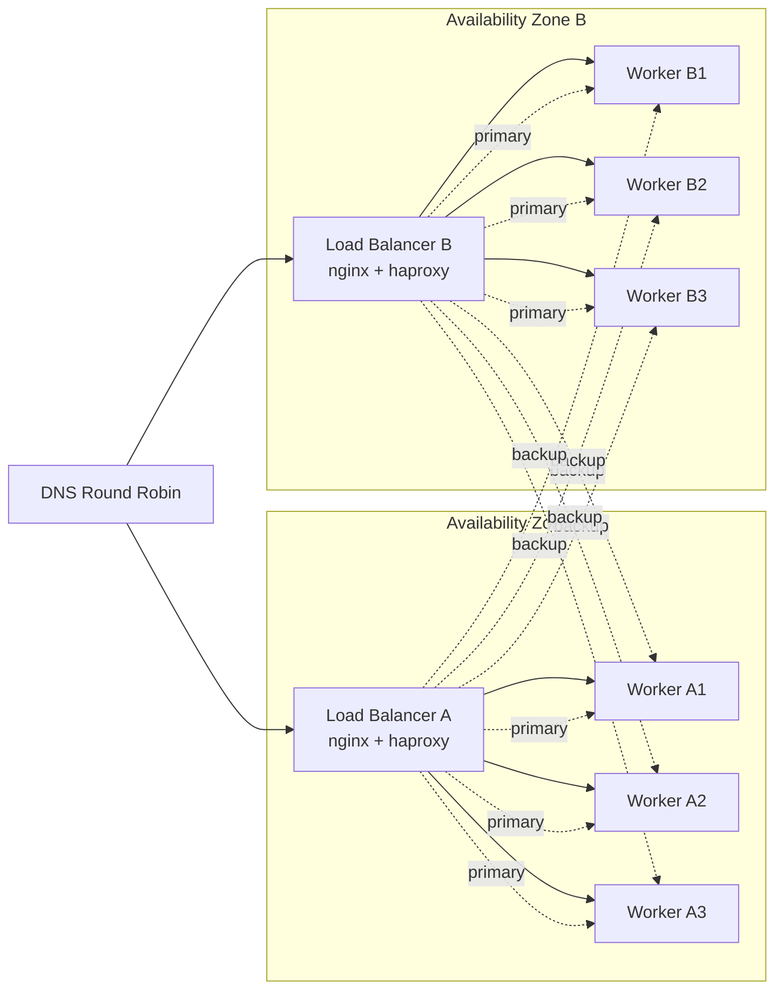

# Systemd Configuration for Gomoku HTTP Daemon

This directory contains systemd unit files and scripts for managing multiple gomoku-httpd daemon instances on a Linux server.

> [!IMPORTANT]
> Please note that the `gomoku-httpd` binary is single-threaded, except for the the health check. It can only be computing a move one at a time. Therefore parallelism here is achived by running one `gomoku-httpd` instance per CPU core.

## Files

| File | Description |
|------|-------------|
| gomoku-httpd@.service | Template unit file for individual instances |
| gomoku-httpd.target | Target to manage all instances as a group |
| install.sh | Installation script |
| gomoku-httpd-ctl | Control script for managing the daemon cluster |

## Systems Architecture Diagram



## Quick Start

```bash
# 1. Build the binary (from project root)
make gomoku-httpd

# 2. Install systemd units (auto-detects CPU cores)
cd iac/systemd
sudo ./install.sh

# 3. Copy the binary to installation directory
sudo cp ../../gomoku-httpd /opt/gomoku/bin/

# 4. Start all instances
sudo systemctl start gomoku-httpd.target

# 5. Check status
./gomoku-httpd-ctl status
```

## Installation Options

```bash
# Install with custom options
sudo ./install.sh \
    --num-instances 10 \
    --start-port 9000 \
    --install-dir /opt/app \
    --user myuser
```

## Port Allocation

Each instance uses two ports:
- HTTP Port: The main API port (specified in instance name)
- Agent Port: HTTP Port + 1000 (for HAProxy agent-check)

Example with default settings:

| Instance | HTTP Port | Agent Port |
|----------|-----------|------------|
| gomoku-httpd@8787 | 8787 | 9787 |
| gomoku-httpd@8788 | 8788 | 9788 |
| gomoku-httpd@8789 | 8789 | 9789 |

## Using gomoku-httpd-ctl

The gomoku-httpd-ctl script provides a convenient interface for managing the cluster:

```bash
# Start all instances
./gomoku-httpd-ctl start

# Stop all instances
./gomoku-httpd-ctl stop

# Restart all instances
./gomoku-httpd-ctl restart

# Check status of all instances
./gomoku-httpd-ctl status

# List configured ports
./gomoku-httpd-ctl list

# Follow logs from all instances
./gomoku-httpd-ctl logs

# Check health of all instances
./gomoku-httpd-ctl health

# Operate on specific port only
./gomoku-httpd-ctl status --port 8787
./gomoku-httpd-ctl restart --port 8787
```

# Start/stop individual instance

```bash
sudo systemctl start gomoku-httpd@8787
sudo systemctl stop  gomoku-httpd@8787
```

# Start/stop all instances via target

```bash
sudo systemctl start gomoku-httpd.target
sudo systemctl stop  gomoku-httpd.target
```

# Enable instances to start at boot

```bash
sudo systemctl enable gomoku-httpd@8787
sudo systemctl enable gomoku-httpd.target
```

# View logs

```bash
journalctl -u gomoku-httpd@8787 -f
```

# Check status

```bash
systemctl status gomoku-httpd.target
```

## Configuration Customization

### Override Environment Variables

Create a drop-in file to customize environment:

```bash
sudo mkdir -p /etc/systemd/system/gomoku-httpd@.service.d/
cat << 'EOF' | sudo tee /etc/systemd/system/gomoku-httpd@.service.d/override.conf
[Service]
Environment="GOMOKU_LOG_LEVEL=debug"
Environment="GOMOKU_BIND_HOST=127.0.0.1"
EOF
sudo systemctl daemon-reload
```

## HAProxy Configuration

When using with HAProxy, configure backends to use the agent-check ports:

```haproxy
backend gomoku
    balance leastconn
    option httpchk GET /health
    
    server srv1 127.0.0.1:8787 check agent-check agent-port 9787 agent-inter 1s
    server srv2 127.0.0.1:8788 check agent-check agent-port 9788 agent-inter 1s
    server srv3 127.0.0.1:8789 check agent-check agent-port 9789 agent-inter 1s
    server srv4 127.0.0.1:8790 check agent-check agent-port 9790 agent-inter 1s
    server srv5 127.0.0.1:8791 check agent-check agent-port 9791 agent-inter 1s
```

## Monitoring

### Check Instance Health

```bash
# HTTP health check
for port in 8787 8788 8789; do
    echo -n "Port $port: "
    curl -s http://localhost:$port/health | jq -r '.status'
done

# Agent check (returns 'ready' or 'drain')
for port in 9787 9788 9789; do
    echo -n "Agent $port: "
    echo "" | nc -w 1 localhost $port
done
```

## Uninstallation

```bash
# Stop and disable all instances
sudo systemctl stop gomoku-httpd.target
sudo systemctl disable gomoku-httpd.target

# Remove unit files
sudo rm /etc/systemd/system/gomoku-httpd@.service
sudo rm /etc/systemd/system/gomoku-httpd.target
sudo systemctl daemon-reload

# Remove installation (optional)
sudo rm -rf /opt/gomoku
sudo userdel gomoku
```

## Troubleshooting

### Instance Won't Start

```bash
# Check logs for errors
journalctl -u gomoku-httpd@8787 -n 50

# Verify binary exists and is executable
ls -la /opt/gomoku/bin/gomoku-httpd

# Test running manually
sudo -u gomoku /opt/gomoku/bin/gomoku-httpd -b 0.0.0.0:8787 -a 9787 -L debug
```

### Port Already in Use

```bash
# Find what's using the port
sudo lsof -i :8787
sudo ss -tlnp | grep 8787
```
